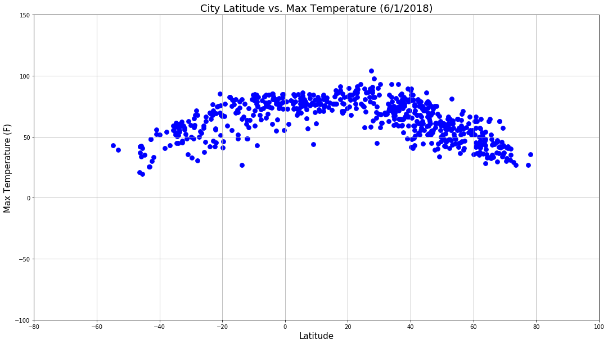
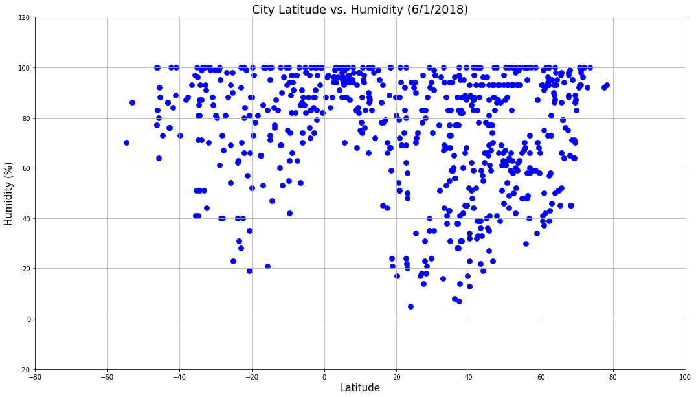
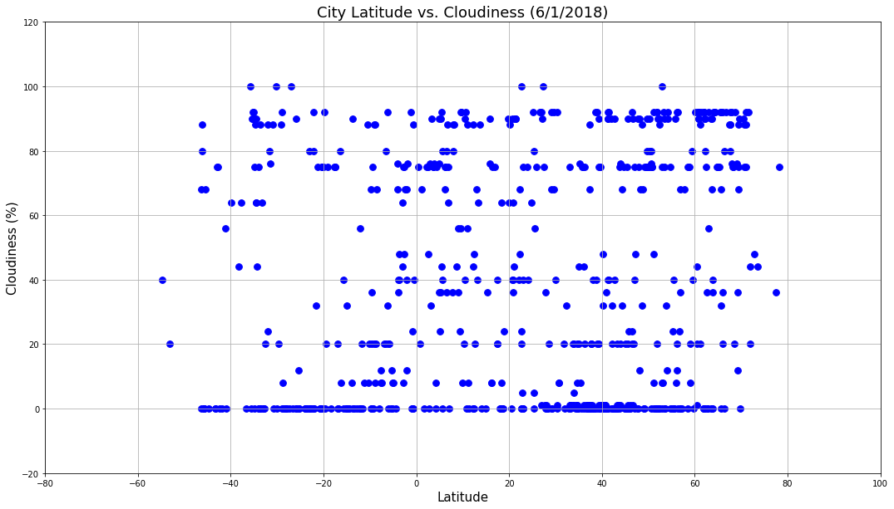
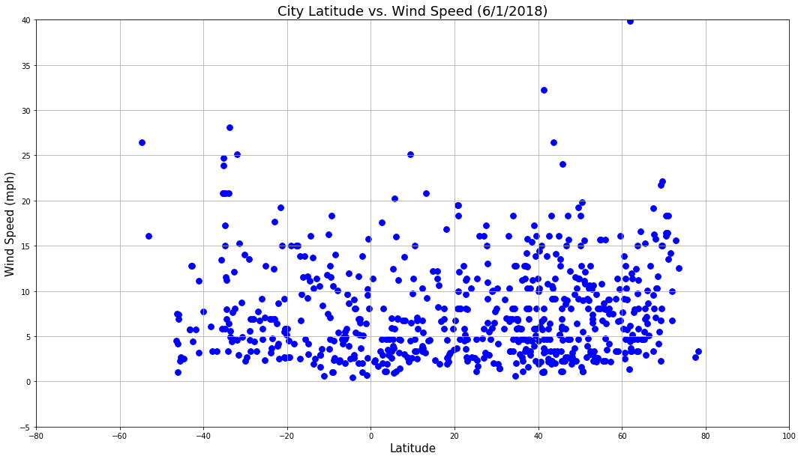

```python
#Dependencies

import json
import requests
import numpy as np
import pandas as pd
from pprint import pprint
import matplotlib.pyplot as plt
import openweathermapy.core as owm
from citipy import citipy
```


```python
#Import API Key 
from config import weather_key
```


```python
#List of Lats and Lons 

latitude = []
longitude = []

for each_lat in np.random.randint(-90,90,2000):
    latitude.append(each_lat)

for each_lon in np.random.randint(-180,180,2000):
    longitude.append(each_lon)
    

latitude_and_Longitude = tuple(zip(latitude,longitude))

```

### Generate Cities List


```python
cities = []
country = []

for lat,lon in latitude_and_Longitude:
    city = citipy.nearest_city(lat,lon)

    cityName = city.city_name
    cities.append(cityName)
    country.append(city.country_code)
 
```


```python
df_cities = pd.DataFrame({'Cities': cities,
                         'Country': country})


#Get rid of duplicative Cities from DataFrame
df_cities = df_cities.drop_duplicates(subset=['Cities'],keep='first')
df_cities.head()
```


<div>
<style scoped>
    .dataframe tbody tr th:only-of-type {
        vertical-align: middle;
    }

    .dataframe tbody tr th {
        vertical-align: top;
    }

    .dataframe thead th {
        text-align: right;
    }
</style>
<table border="1" class="dataframe">
  <thead>
    <tr style="text-align: right;">
      <th></th>
      <th>Cities</th>
      <th>Country</th>
    </tr>
  </thead>
  <tbody>
    <tr>
      <th>0</th>
      <td>sidi ali</td>
      <td>dz</td>
    </tr>
    <tr>
      <th>1</th>
      <td>naranjal</td>
      <td>py</td>
    </tr>
    <tr>
      <th>2</th>
      <td>portland</td>
      <td>au</td>
    </tr>
    <tr>
      <th>3</th>
      <td>qaanaaq</td>
      <td>gl</td>
    </tr>
    <tr>
      <th>4</th>
      <td>asayita</td>
      <td>et</td>
    </tr>
  </tbody>
</table>
</div>


```python
#create empty columns to accommodate City_ID, Lat, Lon, Temp_Max, Humidity, Wind and Cloudiness

df_cities['Latitude'] = ''
df_cities['Longitude'] = ''
df_cities['Temperature (F)'] = ''
df_cities['Humidity (%)'] = ''
df_cities['Cloudiness (%)'] = ''
df_cities['Wind Speed (mph)'] = ''
df_cities.head()
```


<div>
<style scoped>
    .dataframe tbody tr th:only-of-type {
        vertical-align: middle;
    }

    .dataframe tbody tr th {
        vertical-align: top;
    }

    .dataframe thead th {
        text-align: right;
    }
</style>
<table border="1" class="dataframe">
  <thead>
    <tr style="text-align: right;">
      <th></th>
      <th>Cities</th>
      <th>Country</th>
      <th>Latitude</th>
      <th>Longitude</th>
      <th>Temperature (F)</th>
      <th>Humidity (%)</th>
      <th>Cloudiness (%)</th>
      <th>Wind Speed (mph)</th>
    </tr>
  </thead>
  <tbody>
    <tr>
      <th>0</th>
      <td>sidi ali</td>
      <td>dz</td>
      <td></td>
      <td></td>
      <td></td>
      <td></td>
      <td></td>
      <td></td>
    </tr>
    <tr>
      <th>1</th>
      <td>naranjal</td>
      <td>py</td>
      <td></td>
      <td></td>
      <td></td>
      <td></td>
      <td></td>
      <td></td>
    </tr>
    <tr>
      <th>2</th>
      <td>portland</td>
      <td>au</td>
      <td></td>
      <td></td>
      <td></td>
      <td></td>
      <td></td>
      <td></td>
    </tr>
    <tr>
      <th>3</th>
      <td>qaanaaq</td>
      <td>gl</td>
      <td></td>
      <td></td>
      <td></td>
      <td></td>
      <td></td>
      <td></td>
    </tr>
    <tr>
      <th>4</th>
      <td>asayita</td>
      <td>et</td>
      <td></td>
      <td></td>
      <td></td>
      <td></td>
      <td></td>
      <td></td>
    </tr>
  </tbody>
</table>
</div>


### Perform API Calls


```python
for index,row in df_cities.iterrows():
    city_name = row['Cities']
    country_id = row['Country']
    
   #Create Base Url based on City List
    base_url = "http://api.openweathermap.org/data/2.5/weather?"
    query_url = base_url + "appid=" + weather_key + "&q=" + city_name + "&units=imperial"
  
    #Run Request
    weather_response = requests.get(query_url)
    weather_json = weather_response.json()
    print(query_url)


    #Append values to empty DataFrame columns
    try:
        
        row['Latitude'] = weather_json['coord']['lat']
        row['Longitude'] = weather_json['coord']['lon']
        row['Temperature (F)'] = weather_json['main']['temp_max']
        row['Humidity (%)'] = weather_json['main']['humidity']
        row['Cloudiness (%)'] = weather_json['clouds']['all']
        row['Wind Speed (mph)'] = weather_json['wind']['speed']
    except:
        print("Error with weather data, skipping.")
    continue


```

    http://api.openweathermap.org/data/2.5/weather?appid=a454a2728155fbb6430895d8d4f88fc7&q=sidi ali&units=imperial
    http://api.openweathermap.org/data/2.5/weather?appid=a454a2728155fbb6430895d8d4f88fc7&q=naranjal&units=imperial
    http://api.openweathermap.org/data/2.5/weather?appid=a454a2728155fbb6430895d8d4f88fc7&q=portland&units=imperial
    http://api.openweathermap.org/data/2.5/weather?appid=a454a2728155fbb6430895d8d4f88fc7&q=qaanaaq&units=imperial
    http://api.openweathermap.org/data/2.5/weather?appid=a454a2728155fbb6430895d8d4f88fc7&q=soyo&units=imperial
    http://api.openweathermap.org/data/2.5/weather?appid=a454a2728155fbb6430895d8d4f88fc7&q=mahebourg&units=imperial
    http://api.openweathermap.org/data/2.5/weather?appid=a454a2728155fbb6430895d8d4f88fc7&q=padang&units=imperial
    http://api.openweathermap.org/data/2.5/weather?appid=a454a2728155fbb6430895d8d4f88fc7&q=zyryanka&units=imperial
    http://api.openweathermap.org/data/2.5/weather?appid=a454a2728155fbb6430895d8d4f88fc7&q=puerto ayora&units=imperial
    http://api.openweathermap.org/data/2.5/weather?appid=a454a2728155fbb6430895d8d4f88fc7&q=cabo san lucas&units=imperial
    http://api.openweathermap.org/data/2.5/weather?appid=a454a2728155fbb6430895d8d4f88fc7&q=norman wells&units=imperial
    http://api.openweathermap.org/data/2.5/weather?appid=a454a2728155fbb6430895d8d4f88fc7&q=ponta do sol&units=imperial
    http://api.openweathermap.org/data/2.5/weather?appid=a454a2728155fbb6430895d8d4f88fc7&q=constitucion&units=imperial
    http://api.openweathermap.org/data/2.5/weather?appid=a454a2728155fbb6430895d8d4f88fc7&q=pevek&units=imperial
    http://api.openweathermap.org/data/2.5/weather?appid=a454a2728155fbb6430895d8d4f88fc7&q=cape town&units=imperial
    http://api.openweathermap.org/data/2.5/weather?appid=a454a2728155fbb6430895d8d4f88fc7&q=sibu&units=imperial
    http://api.openweathermap.org/data/2.5/weather?appid=a454a2728155fbb6430895d8d4f88fc7&q=aksu&units=imperial
    http://api.openweathermap.org/data/2.5/weather?appid=a454a2728155fbb6430895d8d4f88fc7&q=pangoa&units=imperial
    http://api.openweathermap.org/data/2.5/weather?appid=a454a2728155fbb6430895d8d4f88fc7&q=exeter&units=imperial
    http://api.openweathermap.org/data/2.5/weather?appid=a454a2728155fbb6430895d8d4f88fc7&q=rikitea&units=imperial
    http://api.openweathermap.org/data/2.5/weather?appid=a454a2728155fbb6430895d8d4f88fc7&q=avarua&units=imperial
    http://api.openweathermap.org/data/2.5/weather?appid=a454a2728155fbb6430895d8d4f88fc7&q=albany&units=imperial
    http://api.openweathermap.org/data/2.5/weather?appid=a454a2728155fbb6430895d8d4f88fc7&q=warrington&units=imperial
    http://api.openweathermap.org/data/2.5/weather?appid=a454a2728155fbb6430895d8d4f88fc7&q=namibe&units=imperial
    http://api.openweathermap.org/data/2.5/weather?appid=a454a2728155fbb6430895d8d4f88fc7&q=punta arenas&units=imperial
    http://api.openweathermap.org/data/2.5/weather?appid=a454a2728155fbb6430895d8d4f88fc7&q=busselton&units=imperial
    http://api.openweathermap.org/data/2.5/weather?appid=a454a2728155fbb6430895d8d4f88fc7&q=wuchang&units=imperial
    http://api.openweathermap.org/data/2.5/weather?appid=a454a2728155fbb6430895d8d4f88fc7&q=rawson&units=imperial
    http://api.openweathermap.org/data/2.5/weather?appid=a454a2728155fbb6430895d8d4f88fc7&q=yellowknife&units=imperial
    http://api.openweathermap.org/data/2.5/weather?appid=a454a2728155fbb6430895d8d4f88fc7&q=lata&units=imperial
    http://api.openweathermap.org/data/2.5/weather?appid=a454a2728155fbb6430895d8d4f88fc7&q=clearwater&units=imperial
    http://api.openweathermap.org/data/2.5/weather?appid=a454a2728155fbb6430895d8d4f88fc7&q=sabinas&units=imperial
    http://api.openweathermap.org/data/2.5/weather?appid=a454a2728155fbb6430895d8d4f88fc7&q=mayo&units=imperial
    http://api.openweathermap.org/data/2.5/weather?appid=a454a2728155fbb6430895d8d4f88fc7&q=san cristobal&units=imperial
    http://api.openweathermap.org/data/2.5/weather?appid=a454a2728155fbb6430895d8d4f88fc7&q=ribeira grande&units=imperial
    http://api.openweathermap.org/data/2.5/weather?appid=a454a2728155fbb6430895d8d4f88fc7&q=ushuaia&units=imperial
    http://api.openweathermap.org/data/2.5/weather?appid=a454a2728155fbb6430895d8d4f88fc7&q=yantal&units=imperial
    http://api.openweathermap.org/data/2.5/weather?appid=a454a2728155fbb6430895d8d4f88fc7&q=mukhen&units=imperial
    http://api.openweathermap.org/data/2.5/weather?appid=a454a2728155fbb6430895d8d4f88fc7&q=kaitangata&units=imperial
    http://api.openweathermap.org/data/2.5/weather?appid=a454a2728155fbb6430895d8d4f88fc7&q=hay river&units=imperial
    http://api.openweathermap.org/data/2.5/weather?appid=a454a2728155fbb6430895d8d4f88fc7&q=burns lake&units=imperial
    http://api.openweathermap.org/data/2.5/weather?appid=a454a2728155fbb6430895d8d4f88fc7&q=hermanus&units=imperial
    http://api.openweathermap.org/data/2.5/weather?appid=a454a2728155fbb6430895d8d4f88fc7&q=georgetown&units=imperial
    http://api.openweathermap.org/data/2.5/weather?appid=a454a2728155fbb6430895d8d4f88fc7&q=westport&units=imperial
    http://api.openweathermap.org/data/2.5/weather?appid=a454a2728155fbb6430895d8d4f88fc7&q=upernavik&units=imperial
    http://api.openweathermap.org/data/2.5/weather?appid=a454a2728155fbb6430895d8d4f88fc7&q=sibolga&units=imperial
    http://api.openweathermap.org/data/2.5/weather?appid=a454a2728155fbb6430895d8d4f88fc7&q=nha trang&units=imperial
    http://api.openweathermap.org/data/2.5/weather?appid=a454a2728155fbb6430895d8d4f88fc7&q=barrow&units=imperial
    http://api.openweathermap.org/data/2.5/weather?appid=a454a2728155fbb6430895d8d4f88fc7&q=namatanai&units=imperial
    http://api.openweathermap.org/data/2.5/weather?appid=a454a2728155fbb6430895d8d4f88fc7&q=narsaq&units=imperial
    http://api.openweathermap.org/data/2.5/weather?appid=a454a2728155fbb6430895d8d4f88fc7&q=nanortalik&units=imperial
    http://api.openweathermap.org/data/2.5/weather?appid=a454a2728155fbb6430895d8d4f88fc7&q=peniche&units=imperial
    http://api.openweathermap.org/data/2.5/weather?appid=a454a2728155fbb6430895d8d4f88fc7&q=tuatapere&units=imperial
    http://api.openweathermap.org/data/2.5/weather?appid=a454a2728155fbb6430895d8d4f88fc7&q=atuona&units=imperial
    http://api.openweathermap.org/data/2.5/weather?appid=a454a2728155fbb6430895d8d4f88fc7&q=corinto&units=imperial
    http://api.openweathermap.org/data/2.5/weather?appid=a454a2728155fbb6430895d8d4f88fc7&q=chokurdakh&units=imperial
    http://api.openweathermap.org/data/2.5/weather?appid=a454a2728155fbb6430895d8d4f88fc7&q=saint-philippe&units=imperial
    http://api.openweathermap.org/data/2.5/weather?appid=a454a2728155fbb6430895d8d4f88fc7&q=new norfolk&units=imperial
    http://api.openweathermap.org/data/2.5/weather?appid=a454a2728155fbb6430895d8d4f88fc7&q=chifeng&units=imperial
    http://api.openweathermap.org/data/2.5/weather?appid=a454a2728155fbb6430895d8d4f88fc7&q=vostok&units=imperial
    http://api.openweathermap.org/data/2.5/weather?appid=a454a2728155fbb6430895d8d4f88fc7&q=mataura&units=imperial
    http://api.openweathermap.org/data/2.5/weather?appid=a454a2728155fbb6430895d8d4f88fc7&q=concordia&units=imperial
    http://api.openweathermap.org/data/2.5/weather?appid=a454a2728155fbb6430895d8d4f88fc7&q=takoradi&units=imperial
    http://api.openweathermap.org/data/2.5/weather?appid=a454a2728155fbb6430895d8d4f88fc7&q=mareeba&units=imperial
    http://api.openweathermap.org/data/2.5/weather?appid=a454a2728155fbb6430895d8d4f88fc7&q=bonnyville&units=imperial
    http://api.openweathermap.org/data/2.5/weather?appid=a454a2728155fbb6430895d8d4f88fc7&q=sola&units=imperial
    http://api.openweathermap.org/data/2.5/weather?appid=a454a2728155fbb6430895d8d4f88fc7&q=praia da vitoria&units=imperial
    http://api.openweathermap.org/data/2.5/weather?appid=a454a2728155fbb6430895d8d4f88fc7&q=tautira&units=imperial
    http://api.openweathermap.org/data/2.5/weather?appid=a454a2728155fbb6430895d8d4f88fc7&q=fortuna&units=imperial
    http://api.openweathermap.org/data/2.5/weather?appid=a454a2728155fbb6430895d8d4f88fc7&q=hobart&units=imperial
    http://api.openweathermap.org/data/2.5/weather?appid=a454a2728155fbb6430895d8d4f88fc7&q=nibbar&units=imperial
    http://api.openweathermap.org/data/2.5/weather?appid=a454a2728155fbb6430895d8d4f88fc7&q=fukue&units=imperial
    http://api.openweathermap.org/data/2.5/weather?appid=a454a2728155fbb6430895d8d4f88fc7&q=guerrero negro&units=imperial
    http://api.openweathermap.org/data/2.5/weather?appid=a454a2728155fbb6430895d8d4f88fc7&q=khatanga&units=imperial
    http://api.openweathermap.org/data/2.5/weather?appid=a454a2728155fbb6430895d8d4f88fc7&q=leningradskiy&units=imperial
    http://api.openweathermap.org/data/2.5/weather?appid=a454a2728155fbb6430895d8d4f88fc7&q=olinda&units=imperial
    http://api.openweathermap.org/data/2.5/weather?appid=a454a2728155fbb6430895d8d4f88fc7&q=tasiilaq&units=imperial
    http://api.openweathermap.org/data/2.5/weather?appid=a454a2728155fbb6430895d8d4f88fc7&q=buta&units=imperial
    http://api.openweathermap.org/data/2.5/weather?appid=a454a2728155fbb6430895d8d4f88fc7&q=bredasdorp&units=imperial
    http://api.openweathermap.org/data/2.5/weather?appid=a454a2728155fbb6430895d8d4f88fc7&q=brae&units=imperial
    http://api.openweathermap.org/data/2.5/weather?appid=a454a2728155fbb6430895d8d4f88fc7&q=jamestown&units=imperial
    http://api.openweathermap.org/data/2.5/weather?appid=a454a2728155fbb6430895d8d4f88fc7&q=haines junction&units=imperial
    http://api.openweathermap.org/data/2.5/weather?appid=a454a2728155fbb6430895d8d4f88fc7&q=geraldton&units=imperial
    http://api.openweathermap.org/data/2.5/weather?appid=a454a2728155fbb6430895d8d4f88fc7&q=codrington&units=imperial
    http://api.openweathermap.org/data/2.5/weather?appid=a454a2728155fbb6430895d8d4f88fc7&q=bluff&units=imperial
    http://api.openweathermap.org/data/2.5/weather?appid=a454a2728155fbb6430895d8d4f88fc7&q=coahuayana&units=imperial
    http://api.openweathermap.org/data/2.5/weather?appid=a454a2728155fbb6430895d8d4f88fc7&q=carnarvon&units=imperial
    http://api.openweathermap.org/data/2.5/weather?appid=a454a2728155fbb6430895d8d4f88fc7&q=san patricio&units=imperial
    http://api.openweathermap.org/data/2.5/weather?appid=a454a2728155fbb6430895d8d4f88fc7&q=vaini&units=imperial
    http://api.openweathermap.org/data/2.5/weather?appid=a454a2728155fbb6430895d8d4f88fc7&q=banyo&units=imperial
    http://api.openweathermap.org/data/2.5/weather?appid=a454a2728155fbb6430895d8d4f88fc7&q=dikson&units=imperial
    http://api.openweathermap.org/data/2.5/weather?appid=a454a2728155fbb6430895d8d4f88fc7&q=nikolskoye&units=imperial
    http://api.openweathermap.org/data/2.5/weather?appid=a454a2728155fbb6430895d8d4f88fc7&q=mehamn&units=imperial
    http://api.openweathermap.org/data/2.5/weather?appid=a454a2728155fbb6430895d8d4f88fc7&q=mar del plata&units=imperial
    http://api.openweathermap.org/data/2.5/weather?appid=a454a2728155fbb6430895d8d4f88fc7&q=tuktoyaktuk&units=imperial
    http://api.openweathermap.org/data/2.5/weather?appid=a454a2728155fbb6430895d8d4f88fc7&q=hithadhoo&units=imperial
    http://api.openweathermap.org/data/2.5/weather?appid=a454a2728155fbb6430895d8d4f88fc7&q=astoria&units=imperial
    http://api.openweathermap.org/data/2.5/weather?appid=a454a2728155fbb6430895d8d4f88fc7&q=airai&units=imperial
    http://api.openweathermap.org/data/2.5/weather?appid=a454a2728155fbb6430895d8d4f88fc7&q=seymchan&units=imperial
    http://api.openweathermap.org/data/2.5/weather?appid=a454a2728155fbb6430895d8d4f88fc7&q=itarema&units=imperial
    http://api.openweathermap.org/data/2.5/weather?appid=a454a2728155fbb6430895d8d4f88fc7&q=makakilo city&units=imperial
    http://api.openweathermap.org/data/2.5/weather?appid=a454a2728155fbb6430895d8d4f88fc7&q=bambous virieux&units=imperial
    http://api.openweathermap.org/data/2.5/weather?appid=a454a2728155fbb6430895d8d4f88fc7&q=bilma&units=imperial
    http://api.openweathermap.org/data/2.5/weather?appid=a454a2728155fbb6430895d8d4f88fc7&q=mapiripan&units=imperial
    http://api.openweathermap.org/data/2.5/weather?appid=a454a2728155fbb6430895d8d4f88fc7&q=honningsvag&units=imperial
    http://api.openweathermap.org/data/2.5/weather?appid=a454a2728155fbb6430895d8d4f88fc7&q=karratha&units=imperial
    http://api.openweathermap.org/data/2.5/weather?appid=a454a2728155fbb6430895d8d4f88fc7&q=doha&units=imperial
    http://api.openweathermap.org/data/2.5/weather?appid=a454a2728155fbb6430895d8d4f88fc7&q=kedougou&units=imperial
    http://api.openweathermap.org/data/2.5/weather?appid=a454a2728155fbb6430895d8d4f88fc7&q=komsomolskiy&units=imperial
    http://api.openweathermap.org/data/2.5/weather?appid=a454a2728155fbb6430895d8d4f88fc7&q=faanui&units=imperial
    http://api.openweathermap.org/data/2.5/weather?appid=a454a2728155fbb6430895d8d4f88fc7&q=haflong&units=imperial
    http://api.openweathermap.org/data/2.5/weather?appid=a454a2728155fbb6430895d8d4f88fc7&q=longyearbyen&units=imperial
    http://api.openweathermap.org/data/2.5/weather?appid=a454a2728155fbb6430895d8d4f88fc7&q=roseburg&units=imperial
    http://api.openweathermap.org/data/2.5/weather?appid=a454a2728155fbb6430895d8d4f88fc7&q=saskylakh&units=imperial
    http://api.openweathermap.org/data/2.5/weather?appid=a454a2728155fbb6430895d8d4f88fc7&q=kapaa&units=imperial
    http://api.openweathermap.org/data/2.5/weather?appid=a454a2728155fbb6430895d8d4f88fc7&q=havre-saint-pierre&units=imperial
    http://api.openweathermap.org/data/2.5/weather?appid=a454a2728155fbb6430895d8d4f88fc7&q=acapulco&units=imperial
    http://api.openweathermap.org/data/2.5/weather?appid=a454a2728155fbb6430895d8d4f88fc7&q=sungaipenuh&units=imperial
    http://api.openweathermap.org/data/2.5/weather?appid=a454a2728155fbb6430895d8d4f88fc7&q=awbari&units=imperial
    http://api.openweathermap.org/data/2.5/weather?appid=a454a2728155fbb6430895d8d4f88fc7&q=ostrovnoy&units=imperial
    http://api.openweathermap.org/data/2.5/weather?appid=a454a2728155fbb6430895d8d4f88fc7&q=aripuana&units=imperial
    http://api.openweathermap.org/data/2.5/weather?appid=a454a2728155fbb6430895d8d4f88fc7&q=broken hill&units=imperial
    http://api.openweathermap.org/data/2.5/weather?appid=a454a2728155fbb6430895d8d4f88fc7&q=khani&units=imperial
    http://api.openweathermap.org/data/2.5/weather?appid=a454a2728155fbb6430895d8d4f88fc7&q=zhangye&units=imperial
    http://api.openweathermap.org/data/2.5/weather?appid=a454a2728155fbb6430895d8d4f88fc7&q=dunedin&units=imperial
    http://api.openweathermap.org/data/2.5/weather?appid=a454a2728155fbb6430895d8d4f88fc7&q=dapaong&units=imperial
    http://api.openweathermap.org/data/2.5/weather?appid=a454a2728155fbb6430895d8d4f88fc7&q=sinnamary&units=imperial
    http://api.openweathermap.org/data/2.5/weather?appid=a454a2728155fbb6430895d8d4f88fc7&q=cherskiy&units=imperial
    http://api.openweathermap.org/data/2.5/weather?appid=a454a2728155fbb6430895d8d4f88fc7&q=thompson&units=imperial
    http://api.openweathermap.org/data/2.5/weather?appid=a454a2728155fbb6430895d8d4f88fc7&q=knysna&units=imperial
    http://api.openweathermap.org/data/2.5/weather?appid=a454a2728155fbb6430895d8d4f88fc7&q=price&units=imperial
    http://api.openweathermap.org/data/2.5/weather?appid=a454a2728155fbb6430895d8d4f88fc7&q=arroyo&units=imperial
    http://api.openweathermap.org/data/2.5/weather?appid=a454a2728155fbb6430895d8d4f88fc7&q=vao&units=imperial
    http://api.openweathermap.org/data/2.5/weather?appid=a454a2728155fbb6430895d8d4f88fc7&q=victoria&units=imperial
    http://api.openweathermap.org/data/2.5/weather?appid=a454a2728155fbb6430895d8d4f88fc7&q=madang&units=imperial
    http://api.openweathermap.org/data/2.5/weather?appid=a454a2728155fbb6430895d8d4f88fc7&q=atherton&units=imperial
    http://api.openweathermap.org/data/2.5/weather?appid=a454a2728155fbb6430895d8d4f88fc7&q=castro&units=imperial
    http://api.openweathermap.org/data/2.5/weather?appid=a454a2728155fbb6430895d8d4f88fc7&q=klaksvik&units=imperial
    http://api.openweathermap.org/data/2.5/weather?appid=a454a2728155fbb6430895d8d4f88fc7&q=lincoln&units=imperial
    http://api.openweathermap.org/data/2.5/weather?appid=a454a2728155fbb6430895d8d4f88fc7&q=juquitiba&units=imperial
    http://api.openweathermap.org/data/2.5/weather?appid=a454a2728155fbb6430895d8d4f88fc7&q=angoche&units=imperial
    http://api.openweathermap.org/data/2.5/weather?appid=a454a2728155fbb6430895d8d4f88fc7&q=sao filipe&units=imperial
    http://api.openweathermap.org/data/2.5/weather?appid=a454a2728155fbb6430895d8d4f88fc7&q=bosobolo&units=imperial
    http://api.openweathermap.org/data/2.5/weather?appid=a454a2728155fbb6430895d8d4f88fc7&q=milledgeville&units=imperial
    http://api.openweathermap.org/data/2.5/weather?appid=a454a2728155fbb6430895d8d4f88fc7&q=fernie&units=imperial
    http://api.openweathermap.org/data/2.5/weather?appid=a454a2728155fbb6430895d8d4f88fc7&q=goya&units=imperial
    http://api.openweathermap.org/data/2.5/weather?appid=a454a2728155fbb6430895d8d4f88fc7&q=lumeje&units=imperial
    http://api.openweathermap.org/data/2.5/weather?appid=a454a2728155fbb6430895d8d4f88fc7&q=port elizabeth&units=imperial
    http://api.openweathermap.org/data/2.5/weather?appid=a454a2728155fbb6430895d8d4f88fc7&q=sao joao da barra&units=imperial
    http://api.openweathermap.org/data/2.5/weather?appid=a454a2728155fbb6430895d8d4f88fc7&q=yeppoon&units=imperial
    http://api.openweathermap.org/data/2.5/weather?appid=a454a2728155fbb6430895d8d4f88fc7&q=bethel&units=imperial
    http://api.openweathermap.org/data/2.5/weather?appid=a454a2728155fbb6430895d8d4f88fc7&q=taksimo&units=imperial
    http://api.openweathermap.org/data/2.5/weather?appid=a454a2728155fbb6430895d8d4f88fc7&q=chuy&units=imperial
    http://api.openweathermap.org/data/2.5/weather?appid=a454a2728155fbb6430895d8d4f88fc7&q=west bay&units=imperial
    http://api.openweathermap.org/data/2.5/weather?appid=a454a2728155fbb6430895d8d4f88fc7&q=verona&units=imperial
    http://api.openweathermap.org/data/2.5/weather?appid=a454a2728155fbb6430895d8d4f88fc7&q=ishim&units=imperial
    http://api.openweathermap.org/data/2.5/weather?appid=a454a2728155fbb6430895d8d4f88fc7&q=charters towers&units=imperial
    http://api.openweathermap.org/data/2.5/weather?appid=a454a2728155fbb6430895d8d4f88fc7&q=khash&units=imperial
    http://api.openweathermap.org/data/2.5/weather?appid=a454a2728155fbb6430895d8d4f88fc7&q=mlonggo&units=imperial
    http://api.openweathermap.org/data/2.5/weather?appid=a454a2728155fbb6430895d8d4f88fc7&q=manosque&units=imperial
    http://api.openweathermap.org/data/2.5/weather?appid=a454a2728155fbb6430895d8d4f88fc7&q=chunskiy&units=imperial
    http://api.openweathermap.org/data/2.5/weather?appid=a454a2728155fbb6430895d8d4f88fc7&q=rio grande&units=imperial
    http://api.openweathermap.org/data/2.5/weather?appid=a454a2728155fbb6430895d8d4f88fc7&q=najran&units=imperial
    http://api.openweathermap.org/data/2.5/weather?appid=a454a2728155fbb6430895d8d4f88fc7&q=sao felix do xingu&units=imperial
    http://api.openweathermap.org/data/2.5/weather?appid=a454a2728155fbb6430895d8d4f88fc7&q=kenai&units=imperial
    http://api.openweathermap.org/data/2.5/weather?appid=a454a2728155fbb6430895d8d4f88fc7&q=kyabe&units=imperial
    http://api.openweathermap.org/data/2.5/weather?appid=a454a2728155fbb6430895d8d4f88fc7&q=buluang&units=imperial
    http://api.openweathermap.org/data/2.5/weather?appid=a454a2728155fbb6430895d8d4f88fc7&q=smithers&units=imperial
    http://api.openweathermap.org/data/2.5/weather?appid=a454a2728155fbb6430895d8d4f88fc7&q=ixtapa&units=imperial
    http://api.openweathermap.org/data/2.5/weather?appid=a454a2728155fbb6430895d8d4f88fc7&q=gazli&units=imperial
    http://api.openweathermap.org/data/2.5/weather?appid=a454a2728155fbb6430895d8d4f88fc7&q=hilo&units=imperial
    http://api.openweathermap.org/data/2.5/weather?appid=a454a2728155fbb6430895d8d4f88fc7&q=poum&units=imperial
    http://api.openweathermap.org/data/2.5/weather?appid=a454a2728155fbb6430895d8d4f88fc7&q=sitka&units=imperial
    http://api.openweathermap.org/data/2.5/weather?appid=a454a2728155fbb6430895d8d4f88fc7&q=kruisfontein&units=imperial
    http://api.openweathermap.org/data/2.5/weather?appid=a454a2728155fbb6430895d8d4f88fc7&q=akdepe&units=imperial
    http://api.openweathermap.org/data/2.5/weather?appid=a454a2728155fbb6430895d8d4f88fc7&q=ilebo&units=imperial
    http://api.openweathermap.org/data/2.5/weather?appid=a454a2728155fbb6430895d8d4f88fc7&q=aklavik&units=imperial
    http://api.openweathermap.org/data/2.5/weather?appid=a454a2728155fbb6430895d8d4f88fc7&q=carauari&units=imperial
    http://api.openweathermap.org/data/2.5/weather?appid=a454a2728155fbb6430895d8d4f88fc7&q=north bend&units=imperial
    http://api.openweathermap.org/data/2.5/weather?appid=a454a2728155fbb6430895d8d4f88fc7&q=beitbridge&units=imperial
    http://api.openweathermap.org/data/2.5/weather?appid=a454a2728155fbb6430895d8d4f88fc7&q=ginir&units=imperial
    http://api.openweathermap.org/data/2.5/weather?appid=a454a2728155fbb6430895d8d4f88fc7&q=havoysund&units=imperial
    http://api.openweathermap.org/data/2.5/weather?appid=a454a2728155fbb6430895d8d4f88fc7&q=port hawkesbury&units=imperial
    http://api.openweathermap.org/data/2.5/weather?appid=a454a2728155fbb6430895d8d4f88fc7&q=hambantota&units=imperial
    http://api.openweathermap.org/data/2.5/weather?appid=a454a2728155fbb6430895d8d4f88fc7&q=magnolia&units=imperial
    http://api.openweathermap.org/data/2.5/weather?appid=a454a2728155fbb6430895d8d4f88fc7&q=paso de carrasco&units=imperial
    http://api.openweathermap.org/data/2.5/weather?appid=a454a2728155fbb6430895d8d4f88fc7&q=bhadasar&units=imperial
    http://api.openweathermap.org/data/2.5/weather?appid=a454a2728155fbb6430895d8d4f88fc7&q=yangambi&units=imperial
    http://api.openweathermap.org/data/2.5/weather?appid=a454a2728155fbb6430895d8d4f88fc7&q=ayia marina&units=imperial
    http://api.openweathermap.org/data/2.5/weather?appid=a454a2728155fbb6430895d8d4f88fc7&q=kavaratti&units=imperial
    http://api.openweathermap.org/data/2.5/weather?appid=a454a2728155fbb6430895d8d4f88fc7&q=verkhoyansk&units=imperial
    http://api.openweathermap.org/data/2.5/weather?appid=a454a2728155fbb6430895d8d4f88fc7&q=butaritari&units=imperial
    http://api.openweathermap.org/data/2.5/weather?appid=a454a2728155fbb6430895d8d4f88fc7&q=cidreira&units=imperial
    http://api.openweathermap.org/data/2.5/weather?appid=a454a2728155fbb6430895d8d4f88fc7&q=saint george&units=imperial
    http://api.openweathermap.org/data/2.5/weather?appid=a454a2728155fbb6430895d8d4f88fc7&q=comodoro rivadavia&units=imperial
    http://api.openweathermap.org/data/2.5/weather?appid=a454a2728155fbb6430895d8d4f88fc7&q=mabaruma&units=imperial
    http://api.openweathermap.org/data/2.5/weather?appid=a454a2728155fbb6430895d8d4f88fc7&q=trelew&units=imperial
    http://api.openweathermap.org/data/2.5/weather?appid=a454a2728155fbb6430895d8d4f88fc7&q=iqaluit&units=imperial
    http://api.openweathermap.org/data/2.5/weather?appid=a454a2728155fbb6430895d8d4f88fc7&q=lavrentiya&units=imperial
    http://api.openweathermap.org/data/2.5/weather?appid=a454a2728155fbb6430895d8d4f88fc7&q=taltal&units=imperial
    http://api.openweathermap.org/data/2.5/weather?appid=a454a2728155fbb6430895d8d4f88fc7&q=matranovak&units=imperial
    http://api.openweathermap.org/data/2.5/weather?appid=a454a2728155fbb6430895d8d4f88fc7&q=mmabatho&units=imperial
    http://api.openweathermap.org/data/2.5/weather?appid=a454a2728155fbb6430895d8d4f88fc7&q=vila franca do campo&units=imperial
    http://api.openweathermap.org/data/2.5/weather?appid=a454a2728155fbb6430895d8d4f88fc7&q=beringovskiy&units=imperial
    http://api.openweathermap.org/data/2.5/weather?appid=a454a2728155fbb6430895d8d4f88fc7&q=bandarbeyla&units=imperial
    http://api.openweathermap.org/data/2.5/weather?appid=a454a2728155fbb6430895d8d4f88fc7&q=mendi&units=imperial
    http://api.openweathermap.org/data/2.5/weather?appid=a454a2728155fbb6430895d8d4f88fc7&q=soldotna&units=imperial
    http://api.openweathermap.org/data/2.5/weather?appid=a454a2728155fbb6430895d8d4f88fc7&q=ancud&units=imperial
    http://api.openweathermap.org/data/2.5/weather?appid=a454a2728155fbb6430895d8d4f88fc7&q=east london&units=imperial
    http://api.openweathermap.org/data/2.5/weather?appid=a454a2728155fbb6430895d8d4f88fc7&q=hudson bay&units=imperial
    http://api.openweathermap.org/data/2.5/weather?appid=a454a2728155fbb6430895d8d4f88fc7&q=batemans bay&units=imperial
    http://api.openweathermap.org/data/2.5/weather?appid=a454a2728155fbb6430895d8d4f88fc7&q=biskamzha&units=imperial
    http://api.openweathermap.org/data/2.5/weather?appid=a454a2728155fbb6430895d8d4f88fc7&q=port alfred&units=imperial
    http://api.openweathermap.org/data/2.5/weather?appid=a454a2728155fbb6430895d8d4f88fc7&q=ayan&units=imperial
    http://api.openweathermap.org/data/2.5/weather?appid=a454a2728155fbb6430895d8d4f88fc7&q=eureka&units=imperial
    http://api.openweathermap.org/data/2.5/weather?appid=a454a2728155fbb6430895d8d4f88fc7&q=dubovka&units=imperial
    http://api.openweathermap.org/data/2.5/weather?appid=a454a2728155fbb6430895d8d4f88fc7&q=ahipara&units=imperial
    http://api.openweathermap.org/data/2.5/weather?appid=a454a2728155fbb6430895d8d4f88fc7&q=clemson&units=imperial
    http://api.openweathermap.org/data/2.5/weather?appid=a454a2728155fbb6430895d8d4f88fc7&q=lagoa&units=imperial
    http://api.openweathermap.org/data/2.5/weather?appid=a454a2728155fbb6430895d8d4f88fc7&q=alofi&units=imperial
    http://api.openweathermap.org/data/2.5/weather?appid=a454a2728155fbb6430895d8d4f88fc7&q=ayr&units=imperial
    http://api.openweathermap.org/data/2.5/weather?appid=a454a2728155fbb6430895d8d4f88fc7&q=novobelokatay&units=imperial
    http://api.openweathermap.org/data/2.5/weather?appid=a454a2728155fbb6430895d8d4f88fc7&q=torbay&units=imperial
    http://api.openweathermap.org/data/2.5/weather?appid=a454a2728155fbb6430895d8d4f88fc7&q=bukachacha&units=imperial
    http://api.openweathermap.org/data/2.5/weather?appid=a454a2728155fbb6430895d8d4f88fc7&q=kurdzhinovo&units=imperial
    http://api.openweathermap.org/data/2.5/weather?appid=a454a2728155fbb6430895d8d4f88fc7&q=tolmachevo&units=imperial
    http://api.openweathermap.org/data/2.5/weather?appid=a454a2728155fbb6430895d8d4f88fc7&q=natal&units=imperial
    http://api.openweathermap.org/data/2.5/weather?appid=a454a2728155fbb6430895d8d4f88fc7&q=kodino&units=imperial
    http://api.openweathermap.org/data/2.5/weather?appid=a454a2728155fbb6430895d8d4f88fc7&q=clyde river&units=imperial
    http://api.openweathermap.org/data/2.5/weather?appid=a454a2728155fbb6430895d8d4f88fc7&q=kodiak&units=imperial
    http://api.openweathermap.org/data/2.5/weather?appid=a454a2728155fbb6430895d8d4f88fc7&q=severo-kurilsk&units=imperial
    http://api.openweathermap.org/data/2.5/weather?appid=a454a2728155fbb6430895d8d4f88fc7&q=chara&units=imperial
    http://api.openweathermap.org/data/2.5/weather?appid=a454a2728155fbb6430895d8d4f88fc7&q=kungurtug&units=imperial
    http://api.openweathermap.org/data/2.5/weather?appid=a454a2728155fbb6430895d8d4f88fc7&q=provideniya&units=imperial
    http://api.openweathermap.org/data/2.5/weather?appid=a454a2728155fbb6430895d8d4f88fc7&q=muli&units=imperial
    http://api.openweathermap.org/data/2.5/weather?appid=a454a2728155fbb6430895d8d4f88fc7&q=magugu&units=imperial
    http://api.openweathermap.org/data/2.5/weather?appid=a454a2728155fbb6430895d8d4f88fc7&q=kisarawe&units=imperial
    http://api.openweathermap.org/data/2.5/weather?appid=a454a2728155fbb6430895d8d4f88fc7&q=balabac&units=imperial
    http://api.openweathermap.org/data/2.5/weather?appid=a454a2728155fbb6430895d8d4f88fc7&q=lompoc&units=imperial
    http://api.openweathermap.org/data/2.5/weather?appid=a454a2728155fbb6430895d8d4f88fc7&q=sur&units=imperial
    http://api.openweathermap.org/data/2.5/weather?appid=a454a2728155fbb6430895d8d4f88fc7&q=amalfi&units=imperial
    http://api.openweathermap.org/data/2.5/weather?appid=a454a2728155fbb6430895d8d4f88fc7&q=pisco&units=imperial
    http://api.openweathermap.org/data/2.5/weather?appid=a454a2728155fbb6430895d8d4f88fc7&q=kudahuvadhoo&units=imperial
    http://api.openweathermap.org/data/2.5/weather?appid=a454a2728155fbb6430895d8d4f88fc7&q=bonavista&units=imperial
    http://api.openweathermap.org/data/2.5/weather?appid=a454a2728155fbb6430895d8d4f88fc7&q=satipo&units=imperial
    http://api.openweathermap.org/data/2.5/weather?appid=a454a2728155fbb6430895d8d4f88fc7&q=broome&units=imperial
    http://api.openweathermap.org/data/2.5/weather?appid=a454a2728155fbb6430895d8d4f88fc7&q=marawi&units=imperial
    http://api.openweathermap.org/data/2.5/weather?appid=a454a2728155fbb6430895d8d4f88fc7&q=touros&units=imperial
    http://api.openweathermap.org/data/2.5/weather?appid=a454a2728155fbb6430895d8d4f88fc7&q=souillac&units=imperial
    http://api.openweathermap.org/data/2.5/weather?appid=a454a2728155fbb6430895d8d4f88fc7&q=port victoria&units=imperial
    http://api.openweathermap.org/data/2.5/weather?appid=a454a2728155fbb6430895d8d4f88fc7&q=pionerskiy&units=imperial
    http://api.openweathermap.org/data/2.5/weather?appid=a454a2728155fbb6430895d8d4f88fc7&q=ilulissat&units=imperial
    http://api.openweathermap.org/data/2.5/weather?appid=a454a2728155fbb6430895d8d4f88fc7&q=tessalit&units=imperial
    http://api.openweathermap.org/data/2.5/weather?appid=a454a2728155fbb6430895d8d4f88fc7&q=kalaleh&units=imperial
    http://api.openweathermap.org/data/2.5/weather?appid=a454a2728155fbb6430895d8d4f88fc7&q=fort nelson&units=imperial
    http://api.openweathermap.org/data/2.5/weather?appid=a454a2728155fbb6430895d8d4f88fc7&q=kahului&units=imperial
    http://api.openweathermap.org/data/2.5/weather?appid=a454a2728155fbb6430895d8d4f88fc7&q=lebu&units=imperial
    http://api.openweathermap.org/data/2.5/weather?appid=a454a2728155fbb6430895d8d4f88fc7&q=madimba&units=imperial
    http://api.openweathermap.org/data/2.5/weather?appid=a454a2728155fbb6430895d8d4f88fc7&q=dongsheng&units=imperial
    http://api.openweathermap.org/data/2.5/weather?appid=a454a2728155fbb6430895d8d4f88fc7&q=katherine&units=imperial
    http://api.openweathermap.org/data/2.5/weather?appid=a454a2728155fbb6430895d8d4f88fc7&q=lagos&units=imperial
    http://api.openweathermap.org/data/2.5/weather?appid=a454a2728155fbb6430895d8d4f88fc7&q=flinders&units=imperial
    http://api.openweathermap.org/data/2.5/weather?appid=a454a2728155fbb6430895d8d4f88fc7&q=te anau&units=imperial
    http://api.openweathermap.org/data/2.5/weather?appid=a454a2728155fbb6430895d8d4f88fc7&q=berja&units=imperial
    http://api.openweathermap.org/data/2.5/weather?appid=a454a2728155fbb6430895d8d4f88fc7&q=lulea&units=imperial
    http://api.openweathermap.org/data/2.5/weather?appid=a454a2728155fbb6430895d8d4f88fc7&q=chake chake&units=imperial
    http://api.openweathermap.org/data/2.5/weather?appid=a454a2728155fbb6430895d8d4f88fc7&q=paamiut&units=imperial
    http://api.openweathermap.org/data/2.5/weather?appid=a454a2728155fbb6430895d8d4f88fc7&q=mahuva&units=imperial
    http://api.openweathermap.org/data/2.5/weather?appid=a454a2728155fbb6430895d8d4f88fc7&q=ordu&units=imperial
    http://api.openweathermap.org/data/2.5/weather?appid=a454a2728155fbb6430895d8d4f88fc7&q=shingu&units=imperial
    http://api.openweathermap.org/data/2.5/weather?appid=a454a2728155fbb6430895d8d4f88fc7&q=changde&units=imperial
    http://api.openweathermap.org/data/2.5/weather?appid=a454a2728155fbb6430895d8d4f88fc7&q=hervey bay&units=imperial
    http://api.openweathermap.org/data/2.5/weather?appid=a454a2728155fbb6430895d8d4f88fc7&q=sistranda&units=imperial
    http://api.openweathermap.org/data/2.5/weather?appid=a454a2728155fbb6430895d8d4f88fc7&q=barela&units=imperial
    http://api.openweathermap.org/data/2.5/weather?appid=a454a2728155fbb6430895d8d4f88fc7&q=manyana&units=imperial
    http://api.openweathermap.org/data/2.5/weather?appid=a454a2728155fbb6430895d8d4f88fc7&q=pimenta bueno&units=imperial
    http://api.openweathermap.org/data/2.5/weather?appid=a454a2728155fbb6430895d8d4f88fc7&q=ugoofaaru&units=imperial
    http://api.openweathermap.org/data/2.5/weather?appid=a454a2728155fbb6430895d8d4f88fc7&q=kununurra&units=imperial
    http://api.openweathermap.org/data/2.5/weather?appid=a454a2728155fbb6430895d8d4f88fc7&q=mumbwa&units=imperial
    http://api.openweathermap.org/data/2.5/weather?appid=a454a2728155fbb6430895d8d4f88fc7&q=lensk&units=imperial
    http://api.openweathermap.org/data/2.5/weather?appid=a454a2728155fbb6430895d8d4f88fc7&q=maraa&units=imperial
    http://api.openweathermap.org/data/2.5/weather?appid=a454a2728155fbb6430895d8d4f88fc7&q=aloleng&units=imperial
    http://api.openweathermap.org/data/2.5/weather?appid=a454a2728155fbb6430895d8d4f88fc7&q=kawalu&units=imperial
    http://api.openweathermap.org/data/2.5/weather?appid=a454a2728155fbb6430895d8d4f88fc7&q=herrin&units=imperial
    http://api.openweathermap.org/data/2.5/weather?appid=a454a2728155fbb6430895d8d4f88fc7&q=sao marcos&units=imperial
    http://api.openweathermap.org/data/2.5/weather?appid=a454a2728155fbb6430895d8d4f88fc7&q=meulaboh&units=imperial
    http://api.openweathermap.org/data/2.5/weather?appid=a454a2728155fbb6430895d8d4f88fc7&q=lexington&units=imperial
    http://api.openweathermap.org/data/2.5/weather?appid=a454a2728155fbb6430895d8d4f88fc7&q=jadu&units=imperial
    http://api.openweathermap.org/data/2.5/weather?appid=a454a2728155fbb6430895d8d4f88fc7&q=luderitz&units=imperial
    http://api.openweathermap.org/data/2.5/weather?appid=a454a2728155fbb6430895d8d4f88fc7&q=champerico&units=imperial
    http://api.openweathermap.org/data/2.5/weather?appid=a454a2728155fbb6430895d8d4f88fc7&q=pauini&units=imperial
    http://api.openweathermap.org/data/2.5/weather?appid=a454a2728155fbb6430895d8d4f88fc7&q=itaunja&units=imperial
    http://api.openweathermap.org/data/2.5/weather?appid=a454a2728155fbb6430895d8d4f88fc7&q=evensk&units=imperial
    http://api.openweathermap.org/data/2.5/weather?appid=a454a2728155fbb6430895d8d4f88fc7&q=povenets&units=imperial
    http://api.openweathermap.org/data/2.5/weather?appid=a454a2728155fbb6430895d8d4f88fc7&q=somerset&units=imperial
    http://api.openweathermap.org/data/2.5/weather?appid=a454a2728155fbb6430895d8d4f88fc7&q=walvis bay&units=imperial
    http://api.openweathermap.org/data/2.5/weather?appid=a454a2728155fbb6430895d8d4f88fc7&q=imbituba&units=imperial
    http://api.openweathermap.org/data/2.5/weather?appid=a454a2728155fbb6430895d8d4f88fc7&q=nacala&units=imperial
    http://api.openweathermap.org/data/2.5/weather?appid=a454a2728155fbb6430895d8d4f88fc7&q=kailua&units=imperial
    http://api.openweathermap.org/data/2.5/weather?appid=a454a2728155fbb6430895d8d4f88fc7&q=porto novo&units=imperial
    http://api.openweathermap.org/data/2.5/weather?appid=a454a2728155fbb6430895d8d4f88fc7&q=arraial do cabo&units=imperial
    http://api.openweathermap.org/data/2.5/weather?appid=a454a2728155fbb6430895d8d4f88fc7&q=maniitsoq&units=imperial
    http://api.openweathermap.org/data/2.5/weather?appid=a454a2728155fbb6430895d8d4f88fc7&q=llaillay&units=imperial
    http://api.openweathermap.org/data/2.5/weather?appid=a454a2728155fbb6430895d8d4f88fc7&q=cortez&units=imperial
    http://api.openweathermap.org/data/2.5/weather?appid=a454a2728155fbb6430895d8d4f88fc7&q=angouleme&units=imperial
    http://api.openweathermap.org/data/2.5/weather?appid=a454a2728155fbb6430895d8d4f88fc7&q=victor harbor&units=imperial
    http://api.openweathermap.org/data/2.5/weather?appid=a454a2728155fbb6430895d8d4f88fc7&q=richards bay&units=imperial
    http://api.openweathermap.org/data/2.5/weather?appid=a454a2728155fbb6430895d8d4f88fc7&q=okhotsk&units=imperial
    http://api.openweathermap.org/data/2.5/weather?appid=a454a2728155fbb6430895d8d4f88fc7&q=axim&units=imperial
    http://api.openweathermap.org/data/2.5/weather?appid=a454a2728155fbb6430895d8d4f88fc7&q=kirovskiy&units=imperial
    http://api.openweathermap.org/data/2.5/weather?appid=a454a2728155fbb6430895d8d4f88fc7&q=bariri&units=imperial
    http://api.openweathermap.org/data/2.5/weather?appid=a454a2728155fbb6430895d8d4f88fc7&q=ojinaga&units=imperial
    http://api.openweathermap.org/data/2.5/weather?appid=a454a2728155fbb6430895d8d4f88fc7&q=north myrtle beach&units=imperial
    http://api.openweathermap.org/data/2.5/weather?appid=a454a2728155fbb6430895d8d4f88fc7&q=beidao&units=imperial
    http://api.openweathermap.org/data/2.5/weather?appid=a454a2728155fbb6430895d8d4f88fc7&q=sechenovo&units=imperial
    http://api.openweathermap.org/data/2.5/weather?appid=a454a2728155fbb6430895d8d4f88fc7&q=adrar&units=imperial
    http://api.openweathermap.org/data/2.5/weather?appid=a454a2728155fbb6430895d8d4f88fc7&q=imphal&units=imperial
    http://api.openweathermap.org/data/2.5/weather?appid=a454a2728155fbb6430895d8d4f88fc7&q=nuuk&units=imperial
    http://api.openweathermap.org/data/2.5/weather?appid=a454a2728155fbb6430895d8d4f88fc7&q=morros&units=imperial
    http://api.openweathermap.org/data/2.5/weather?appid=a454a2728155fbb6430895d8d4f88fc7&q=shagonar&units=imperial
    http://api.openweathermap.org/data/2.5/weather?appid=a454a2728155fbb6430895d8d4f88fc7&q=tafresh&units=imperial
    http://api.openweathermap.org/data/2.5/weather?appid=a454a2728155fbb6430895d8d4f88fc7&q=bubaque&units=imperial
    http://api.openweathermap.org/data/2.5/weather?appid=a454a2728155fbb6430895d8d4f88fc7&q=moron&units=imperial
    http://api.openweathermap.org/data/2.5/weather?appid=a454a2728155fbb6430895d8d4f88fc7&q=coihaique&units=imperial
    http://api.openweathermap.org/data/2.5/weather?appid=a454a2728155fbb6430895d8d4f88fc7&q=sao jose de ribamar&units=imperial
    http://api.openweathermap.org/data/2.5/weather?appid=a454a2728155fbb6430895d8d4f88fc7&q=clarksburg&units=imperial
    http://api.openweathermap.org/data/2.5/weather?appid=a454a2728155fbb6430895d8d4f88fc7&q=sira&units=imperial
    http://api.openweathermap.org/data/2.5/weather?appid=a454a2728155fbb6430895d8d4f88fc7&q=sernur&units=imperial
    http://api.openweathermap.org/data/2.5/weather?appid=a454a2728155fbb6430895d8d4f88fc7&q=vredendal&units=imperial
    http://api.openweathermap.org/data/2.5/weather?appid=a454a2728155fbb6430895d8d4f88fc7&q=tevaitoa&units=imperial
    http://api.openweathermap.org/data/2.5/weather?appid=a454a2728155fbb6430895d8d4f88fc7&q=atar&units=imperial
    http://api.openweathermap.org/data/2.5/weather?appid=a454a2728155fbb6430895d8d4f88fc7&q=manta&units=imperial
    http://api.openweathermap.org/data/2.5/weather?appid=a454a2728155fbb6430895d8d4f88fc7&q=ulladulla&units=imperial
    http://api.openweathermap.org/data/2.5/weather?appid=a454a2728155fbb6430895d8d4f88fc7&q=bela vista&units=imperial
    http://api.openweathermap.org/data/2.5/weather?appid=a454a2728155fbb6430895d8d4f88fc7&q=pindiga&units=imperial
    http://api.openweathermap.org/data/2.5/weather?appid=a454a2728155fbb6430895d8d4f88fc7&q=punta gorda&units=imperial
    http://api.openweathermap.org/data/2.5/weather?appid=a454a2728155fbb6430895d8d4f88fc7&q=kunya&units=imperial
    http://api.openweathermap.org/data/2.5/weather?appid=a454a2728155fbb6430895d8d4f88fc7&q=sorland&units=imperial
    http://api.openweathermap.org/data/2.5/weather?appid=a454a2728155fbb6430895d8d4f88fc7&q=port shepstone&units=imperial
    http://api.openweathermap.org/data/2.5/weather?appid=a454a2728155fbb6430895d8d4f88fc7&q=yumen&units=imperial
    http://api.openweathermap.org/data/2.5/weather?appid=a454a2728155fbb6430895d8d4f88fc7&q=santa catarina de tepehuanes&units=imperial
    http://api.openweathermap.org/data/2.5/weather?appid=a454a2728155fbb6430895d8d4f88fc7&q=lorengau&units=imperial
    http://api.openweathermap.org/data/2.5/weather?appid=a454a2728155fbb6430895d8d4f88fc7&q=kavieng&units=imperial
    http://api.openweathermap.org/data/2.5/weather?appid=a454a2728155fbb6430895d8d4f88fc7&q=huanren&units=imperial
    http://api.openweathermap.org/data/2.5/weather?appid=a454a2728155fbb6430895d8d4f88fc7&q=vardo&units=imperial
    http://api.openweathermap.org/data/2.5/weather?appid=a454a2728155fbb6430895d8d4f88fc7&q=jacareacanga&units=imperial
    http://api.openweathermap.org/data/2.5/weather?appid=a454a2728155fbb6430895d8d4f88fc7&q=mandalgovi&units=imperial
    http://api.openweathermap.org/data/2.5/weather?appid=a454a2728155fbb6430895d8d4f88fc7&q=deputatskiy&units=imperial
    http://api.openweathermap.org/data/2.5/weather?appid=a454a2728155fbb6430895d8d4f88fc7&q=mbale&units=imperial
    http://api.openweathermap.org/data/2.5/weather?appid=a454a2728155fbb6430895d8d4f88fc7&q=banda aceh&units=imperial
    http://api.openweathermap.org/data/2.5/weather?appid=a454a2728155fbb6430895d8d4f88fc7&q=novochernorechenskiy&units=imperial
    http://api.openweathermap.org/data/2.5/weather?appid=a454a2728155fbb6430895d8d4f88fc7&q=lemgo&units=imperial
    http://api.openweathermap.org/data/2.5/weather?appid=a454a2728155fbb6430895d8d4f88fc7&q=zhanaozen&units=imperial
    http://api.openweathermap.org/data/2.5/weather?appid=a454a2728155fbb6430895d8d4f88fc7&q=kysyl-syr&units=imperial
    http://api.openweathermap.org/data/2.5/weather?appid=a454a2728155fbb6430895d8d4f88fc7&q=catabola&units=imperial
    http://api.openweathermap.org/data/2.5/weather?appid=a454a2728155fbb6430895d8d4f88fc7&q=nouakchott&units=imperial
    http://api.openweathermap.org/data/2.5/weather?appid=a454a2728155fbb6430895d8d4f88fc7&q=shaunavon&units=imperial
    http://api.openweathermap.org/data/2.5/weather?appid=a454a2728155fbb6430895d8d4f88fc7&q=pteleos&units=imperial
    http://api.openweathermap.org/data/2.5/weather?appid=a454a2728155fbb6430895d8d4f88fc7&q=jabinyanah&units=imperial
    http://api.openweathermap.org/data/2.5/weather?appid=a454a2728155fbb6430895d8d4f88fc7&q=jumla&units=imperial
    http://api.openweathermap.org/data/2.5/weather?appid=a454a2728155fbb6430895d8d4f88fc7&q=kamalpur&units=imperial
    http://api.openweathermap.org/data/2.5/weather?appid=a454a2728155fbb6430895d8d4f88fc7&q=esperance&units=imperial
    http://api.openweathermap.org/data/2.5/weather?appid=a454a2728155fbb6430895d8d4f88fc7&q=zhigansk&units=imperial
    http://api.openweathermap.org/data/2.5/weather?appid=a454a2728155fbb6430895d8d4f88fc7&q=talnakh&units=imperial
    http://api.openweathermap.org/data/2.5/weather?appid=a454a2728155fbb6430895d8d4f88fc7&q=bulembu&units=imperial
    http://api.openweathermap.org/data/2.5/weather?appid=a454a2728155fbb6430895d8d4f88fc7&q=belyy yar&units=imperial
    http://api.openweathermap.org/data/2.5/weather?appid=a454a2728155fbb6430895d8d4f88fc7&q=saldanha&units=imperial
    http://api.openweathermap.org/data/2.5/weather?appid=a454a2728155fbb6430895d8d4f88fc7&q=nevers&units=imperial
    http://api.openweathermap.org/data/2.5/weather?appid=a454a2728155fbb6430895d8d4f88fc7&q=mahajanga&units=imperial
    http://api.openweathermap.org/data/2.5/weather?appid=a454a2728155fbb6430895d8d4f88fc7&q=tiksi&units=imperial
    http://api.openweathermap.org/data/2.5/weather?appid=a454a2728155fbb6430895d8d4f88fc7&q=knoxville&units=imperial
    http://api.openweathermap.org/data/2.5/weather?appid=a454a2728155fbb6430895d8d4f88fc7&q=dingle&units=imperial
    http://api.openweathermap.org/data/2.5/weather?appid=a454a2728155fbb6430895d8d4f88fc7&q=sainte-rose&units=imperial
    http://api.openweathermap.org/data/2.5/weather?appid=a454a2728155fbb6430895d8d4f88fc7&q=chaumont&units=imperial
    http://api.openweathermap.org/data/2.5/weather?appid=a454a2728155fbb6430895d8d4f88fc7&q=alyangula&units=imperial
    http://api.openweathermap.org/data/2.5/weather?appid=a454a2728155fbb6430895d8d4f88fc7&q=raudeberg&units=imperial
    http://api.openweathermap.org/data/2.5/weather?appid=a454a2728155fbb6430895d8d4f88fc7&q=alugan&units=imperial
    http://api.openweathermap.org/data/2.5/weather?appid=a454a2728155fbb6430895d8d4f88fc7&q=novopokrovka&units=imperial
    http://api.openweathermap.org/data/2.5/weather?appid=a454a2728155fbb6430895d8d4f88fc7&q=caxambu&units=imperial
    http://api.openweathermap.org/data/2.5/weather?appid=a454a2728155fbb6430895d8d4f88fc7&q=tromso&units=imperial
    http://api.openweathermap.org/data/2.5/weather?appid=a454a2728155fbb6430895d8d4f88fc7&q=mount gambier&units=imperial
    http://api.openweathermap.org/data/2.5/weather?appid=a454a2728155fbb6430895d8d4f88fc7&q=myanaung&units=imperial
    http://api.openweathermap.org/data/2.5/weather?appid=a454a2728155fbb6430895d8d4f88fc7&q=jawhar&units=imperial
    http://api.openweathermap.org/data/2.5/weather?appid=a454a2728155fbb6430895d8d4f88fc7&q=grants pass&units=imperial
    http://api.openweathermap.org/data/2.5/weather?appid=a454a2728155fbb6430895d8d4f88fc7&q=haapiti&units=imperial
    http://api.openweathermap.org/data/2.5/weather?appid=a454a2728155fbb6430895d8d4f88fc7&q=barreirinha&units=imperial
    http://api.openweathermap.org/data/2.5/weather?appid=a454a2728155fbb6430895d8d4f88fc7&q=oyama&units=imperial
    http://api.openweathermap.org/data/2.5/weather?appid=a454a2728155fbb6430895d8d4f88fc7&q=halifax&units=imperial
    http://api.openweathermap.org/data/2.5/weather?appid=a454a2728155fbb6430895d8d4f88fc7&q=seoul&units=imperial
    http://api.openweathermap.org/data/2.5/weather?appid=a454a2728155fbb6430895d8d4f88fc7&q=srikakulam&units=imperial
    http://api.openweathermap.org/data/2.5/weather?appid=a454a2728155fbb6430895d8d4f88fc7&q=yerbogachen&units=imperial
    http://api.openweathermap.org/data/2.5/weather?appid=a454a2728155fbb6430895d8d4f88fc7&q=jalu&units=imperial
    http://api.openweathermap.org/data/2.5/weather?appid=a454a2728155fbb6430895d8d4f88fc7&q=nakusp&units=imperial
    http://api.openweathermap.org/data/2.5/weather?appid=a454a2728155fbb6430895d8d4f88fc7&q=santa cruz&units=imperial
    http://api.openweathermap.org/data/2.5/weather?appid=a454a2728155fbb6430895d8d4f88fc7&q=valdez&units=imperial
    http://api.openweathermap.org/data/2.5/weather?appid=a454a2728155fbb6430895d8d4f88fc7&q=mitchell&units=imperial
    http://api.openweathermap.org/data/2.5/weather?appid=a454a2728155fbb6430895d8d4f88fc7&q=saltillo&units=imperial
    http://api.openweathermap.org/data/2.5/weather?appid=a454a2728155fbb6430895d8d4f88fc7&q=birjand&units=imperial
    http://api.openweathermap.org/data/2.5/weather?appid=a454a2728155fbb6430895d8d4f88fc7&q=usinsk&units=imperial
    http://api.openweathermap.org/data/2.5/weather?appid=a454a2728155fbb6430895d8d4f88fc7&q=husavik&units=imperial
    http://api.openweathermap.org/data/2.5/weather?appid=a454a2728155fbb6430895d8d4f88fc7&q=dali&units=imperial
    http://api.openweathermap.org/data/2.5/weather?appid=a454a2728155fbb6430895d8d4f88fc7&q=fairbanks&units=imperial
    http://api.openweathermap.org/data/2.5/weather?appid=a454a2728155fbb6430895d8d4f88fc7&q=laguna&units=imperial
    http://api.openweathermap.org/data/2.5/weather?appid=a454a2728155fbb6430895d8d4f88fc7&q=kalabo&units=imperial
    http://api.openweathermap.org/data/2.5/weather?appid=a454a2728155fbb6430895d8d4f88fc7&q=kabalo&units=imperial
    http://api.openweathermap.org/data/2.5/weather?appid=a454a2728155fbb6430895d8d4f88fc7&q=aljezur&units=imperial
    http://api.openweathermap.org/data/2.5/weather?appid=a454a2728155fbb6430895d8d4f88fc7&q=yakima&units=imperial
    http://api.openweathermap.org/data/2.5/weather?appid=a454a2728155fbb6430895d8d4f88fc7&q=kirensk&units=imperial
    http://api.openweathermap.org/data/2.5/weather?appid=a454a2728155fbb6430895d8d4f88fc7&q=kaeo&units=imperial
    http://api.openweathermap.org/data/2.5/weather?appid=a454a2728155fbb6430895d8d4f88fc7&q=winslow&units=imperial
    http://api.openweathermap.org/data/2.5/weather?appid=a454a2728155fbb6430895d8d4f88fc7&q=bathsheba&units=imperial
    http://api.openweathermap.org/data/2.5/weather?appid=a454a2728155fbb6430895d8d4f88fc7&q=hasaki&units=imperial
    http://api.openweathermap.org/data/2.5/weather?appid=a454a2728155fbb6430895d8d4f88fc7&q=kamaishi&units=imperial
    http://api.openweathermap.org/data/2.5/weather?appid=a454a2728155fbb6430895d8d4f88fc7&q=buloh kasap&units=imperial
    http://api.openweathermap.org/data/2.5/weather?appid=a454a2728155fbb6430895d8d4f88fc7&q=grand gaube&units=imperial
    http://api.openweathermap.org/data/2.5/weather?appid=a454a2728155fbb6430895d8d4f88fc7&q=aguada de pasajeros&units=imperial
    http://api.openweathermap.org/data/2.5/weather?appid=a454a2728155fbb6430895d8d4f88fc7&q=altay&units=imperial
    http://api.openweathermap.org/data/2.5/weather?appid=a454a2728155fbb6430895d8d4f88fc7&q=aquiraz&units=imperial
    http://api.openweathermap.org/data/2.5/weather?appid=a454a2728155fbb6430895d8d4f88fc7&q=den helder&units=imperial
    http://api.openweathermap.org/data/2.5/weather?appid=a454a2728155fbb6430895d8d4f88fc7&q=junction city&units=imperial
    http://api.openweathermap.org/data/2.5/weather?appid=a454a2728155fbb6430895d8d4f88fc7&q=susehri&units=imperial
    http://api.openweathermap.org/data/2.5/weather?appid=a454a2728155fbb6430895d8d4f88fc7&q=san andres&units=imperial
    http://api.openweathermap.org/data/2.5/weather?appid=a454a2728155fbb6430895d8d4f88fc7&q=kamenka&units=imperial
    http://api.openweathermap.org/data/2.5/weather?appid=a454a2728155fbb6430895d8d4f88fc7&q=porto velho&units=imperial
    http://api.openweathermap.org/data/2.5/weather?appid=a454a2728155fbb6430895d8d4f88fc7&q=vestmannaeyjar&units=imperial
    http://api.openweathermap.org/data/2.5/weather?appid=a454a2728155fbb6430895d8d4f88fc7&q=madona&units=imperial
    http://api.openweathermap.org/data/2.5/weather?appid=a454a2728155fbb6430895d8d4f88fc7&q=libreville&units=imperial
    http://api.openweathermap.org/data/2.5/weather?appid=a454a2728155fbb6430895d8d4f88fc7&q=toora-khem&units=imperial
    http://api.openweathermap.org/data/2.5/weather?appid=a454a2728155fbb6430895d8d4f88fc7&q=bilibino&units=imperial
    http://api.openweathermap.org/data/2.5/weather?appid=a454a2728155fbb6430895d8d4f88fc7&q=kurush&units=imperial
    http://api.openweathermap.org/data/2.5/weather?appid=a454a2728155fbb6430895d8d4f88fc7&q=leo&units=imperial
    http://api.openweathermap.org/data/2.5/weather?appid=a454a2728155fbb6430895d8d4f88fc7&q=batticaloa&units=imperial
    http://api.openweathermap.org/data/2.5/weather?appid=a454a2728155fbb6430895d8d4f88fc7&q=petatlan&units=imperial
    http://api.openweathermap.org/data/2.5/weather?appid=a454a2728155fbb6430895d8d4f88fc7&q=gizo&units=imperial
    http://api.openweathermap.org/data/2.5/weather?appid=a454a2728155fbb6430895d8d4f88fc7&q=avera&units=imperial
    http://api.openweathermap.org/data/2.5/weather?appid=a454a2728155fbb6430895d8d4f88fc7&q=copiapo&units=imperial
    http://api.openweathermap.org/data/2.5/weather?appid=a454a2728155fbb6430895d8d4f88fc7&q=dutlwe&units=imperial
    http://api.openweathermap.org/data/2.5/weather?appid=a454a2728155fbb6430895d8d4f88fc7&q=worland&units=imperial
    http://api.openweathermap.org/data/2.5/weather?appid=a454a2728155fbb6430895d8d4f88fc7&q=vila velha&units=imperial
    http://api.openweathermap.org/data/2.5/weather?appid=a454a2728155fbb6430895d8d4f88fc7&q=zhaotong&units=imperial
    http://api.openweathermap.org/data/2.5/weather?appid=a454a2728155fbb6430895d8d4f88fc7&q=rypefjord&units=imperial
    http://api.openweathermap.org/data/2.5/weather?appid=a454a2728155fbb6430895d8d4f88fc7&q=wichita falls&units=imperial
    http://api.openweathermap.org/data/2.5/weather?appid=a454a2728155fbb6430895d8d4f88fc7&q=derzhavinsk&units=imperial
    http://api.openweathermap.org/data/2.5/weather?appid=a454a2728155fbb6430895d8d4f88fc7&q=barra patuca&units=imperial
    http://api.openweathermap.org/data/2.5/weather?appid=a454a2728155fbb6430895d8d4f88fc7&q=leninskoye&units=imperial
    http://api.openweathermap.org/data/2.5/weather?appid=a454a2728155fbb6430895d8d4f88fc7&q=mathbaria&units=imperial
    http://api.openweathermap.org/data/2.5/weather?appid=a454a2728155fbb6430895d8d4f88fc7&q=alta floresta&units=imperial
    http://api.openweathermap.org/data/2.5/weather?appid=a454a2728155fbb6430895d8d4f88fc7&q=hami&units=imperial
    http://api.openweathermap.org/data/2.5/weather?appid=a454a2728155fbb6430895d8d4f88fc7&q=gold coast&units=imperial
    http://api.openweathermap.org/data/2.5/weather?appid=a454a2728155fbb6430895d8d4f88fc7&q=belaya gora&units=imperial
    http://api.openweathermap.org/data/2.5/weather?appid=a454a2728155fbb6430895d8d4f88fc7&q=sao miguel do araguaia&units=imperial
    http://api.openweathermap.org/data/2.5/weather?appid=a454a2728155fbb6430895d8d4f88fc7&q=carballo&units=imperial
    http://api.openweathermap.org/data/2.5/weather?appid=a454a2728155fbb6430895d8d4f88fc7&q=nara&units=imperial
    http://api.openweathermap.org/data/2.5/weather?appid=a454a2728155fbb6430895d8d4f88fc7&q=gao&units=imperial
    http://api.openweathermap.org/data/2.5/weather?appid=a454a2728155fbb6430895d8d4f88fc7&q=baijiantan&units=imperial
    http://api.openweathermap.org/data/2.5/weather?appid=a454a2728155fbb6430895d8d4f88fc7&q=selkirk&units=imperial
    http://api.openweathermap.org/data/2.5/weather?appid=a454a2728155fbb6430895d8d4f88fc7&q=taoudenni&units=imperial
    http://api.openweathermap.org/data/2.5/weather?appid=a454a2728155fbb6430895d8d4f88fc7&q=tursunzoda&units=imperial
    http://api.openweathermap.org/data/2.5/weather?appid=a454a2728155fbb6430895d8d4f88fc7&q=saint-raymond&units=imperial
    http://api.openweathermap.org/data/2.5/weather?appid=a454a2728155fbb6430895d8d4f88fc7&q=oktyabrskoye&units=imperial
    http://api.openweathermap.org/data/2.5/weather?appid=a454a2728155fbb6430895d8d4f88fc7&q=port moresby&units=imperial
    http://api.openweathermap.org/data/2.5/weather?appid=a454a2728155fbb6430895d8d4f88fc7&q=sucua&units=imperial
    http://api.openweathermap.org/data/2.5/weather?appid=a454a2728155fbb6430895d8d4f88fc7&q=svetlaya&units=imperial
    http://api.openweathermap.org/data/2.5/weather?appid=a454a2728155fbb6430895d8d4f88fc7&q=abha&units=imperial
    http://api.openweathermap.org/data/2.5/weather?appid=a454a2728155fbb6430895d8d4f88fc7&q=palmer&units=imperial
    http://api.openweathermap.org/data/2.5/weather?appid=a454a2728155fbb6430895d8d4f88fc7&q=kaohsiung&units=imperial
    http://api.openweathermap.org/data/2.5/weather?appid=a454a2728155fbb6430895d8d4f88fc7&q=red bluff&units=imperial
    http://api.openweathermap.org/data/2.5/weather?appid=a454a2728155fbb6430895d8d4f88fc7&q=camacha&units=imperial
    http://api.openweathermap.org/data/2.5/weather?appid=a454a2728155fbb6430895d8d4f88fc7&q=belmonte&units=imperial
    http://api.openweathermap.org/data/2.5/weather?appid=a454a2728155fbb6430895d8d4f88fc7&q=misratah&units=imperial
    http://api.openweathermap.org/data/2.5/weather?appid=a454a2728155fbb6430895d8d4f88fc7&q=kupang&units=imperial
    http://api.openweathermap.org/data/2.5/weather?appid=a454a2728155fbb6430895d8d4f88fc7&q=hamada&units=imperial
    http://api.openweathermap.org/data/2.5/weather?appid=a454a2728155fbb6430895d8d4f88fc7&q=ozinki&units=imperial
    http://api.openweathermap.org/data/2.5/weather?appid=a454a2728155fbb6430895d8d4f88fc7&q=dukat&units=imperial
    http://api.openweathermap.org/data/2.5/weather?appid=a454a2728155fbb6430895d8d4f88fc7&q=inuvik&units=imperial
    http://api.openweathermap.org/data/2.5/weather?appid=a454a2728155fbb6430895d8d4f88fc7&q=sabha&units=imperial
    http://api.openweathermap.org/data/2.5/weather?appid=a454a2728155fbb6430895d8d4f88fc7&q=young&units=imperial
    http://api.openweathermap.org/data/2.5/weather?appid=a454a2728155fbb6430895d8d4f88fc7&q=barinas&units=imperial
    http://api.openweathermap.org/data/2.5/weather?appid=a454a2728155fbb6430895d8d4f88fc7&q=houma&units=imperial
    http://api.openweathermap.org/data/2.5/weather?appid=a454a2728155fbb6430895d8d4f88fc7&q=harper&units=imperial
    http://api.openweathermap.org/data/2.5/weather?appid=a454a2728155fbb6430895d8d4f88fc7&q=carutapera&units=imperial
    http://api.openweathermap.org/data/2.5/weather?appid=a454a2728155fbb6430895d8d4f88fc7&q=udachnyy&units=imperial
    http://api.openweathermap.org/data/2.5/weather?appid=a454a2728155fbb6430895d8d4f88fc7&q=sukhoy log&units=imperial
    http://api.openweathermap.org/data/2.5/weather?appid=a454a2728155fbb6430895d8d4f88fc7&q=salinas&units=imperial
    http://api.openweathermap.org/data/2.5/weather?appid=a454a2728155fbb6430895d8d4f88fc7&q=fujin&units=imperial
    http://api.openweathermap.org/data/2.5/weather?appid=a454a2728155fbb6430895d8d4f88fc7&q=san quintin&units=imperial
    http://api.openweathermap.org/data/2.5/weather?appid=a454a2728155fbb6430895d8d4f88fc7&q=christiana&units=imperial
    http://api.openweathermap.org/data/2.5/weather?appid=a454a2728155fbb6430895d8d4f88fc7&q=oskarshamn&units=imperial
    http://api.openweathermap.org/data/2.5/weather?appid=a454a2728155fbb6430895d8d4f88fc7&q=yatou&units=imperial
    http://api.openweathermap.org/data/2.5/weather?appid=a454a2728155fbb6430895d8d4f88fc7&q=maldonado&units=imperial
    http://api.openweathermap.org/data/2.5/weather?appid=a454a2728155fbb6430895d8d4f88fc7&q=katangli&units=imperial
    http://api.openweathermap.org/data/2.5/weather?appid=a454a2728155fbb6430895d8d4f88fc7&q=kristianstad&units=imperial
    http://api.openweathermap.org/data/2.5/weather?appid=a454a2728155fbb6430895d8d4f88fc7&q=rovereto&units=imperial
    http://api.openweathermap.org/data/2.5/weather?appid=a454a2728155fbb6430895d8d4f88fc7&q=buchmany&units=imperial
    http://api.openweathermap.org/data/2.5/weather?appid=a454a2728155fbb6430895d8d4f88fc7&q=bobrovka&units=imperial
    http://api.openweathermap.org/data/2.5/weather?appid=a454a2728155fbb6430895d8d4f88fc7&q=muros&units=imperial
    http://api.openweathermap.org/data/2.5/weather?appid=a454a2728155fbb6430895d8d4f88fc7&q=waingapu&units=imperial
    http://api.openweathermap.org/data/2.5/weather?appid=a454a2728155fbb6430895d8d4f88fc7&q=nagato&units=imperial
    http://api.openweathermap.org/data/2.5/weather?appid=a454a2728155fbb6430895d8d4f88fc7&q=maceio&units=imperial
    http://api.openweathermap.org/data/2.5/weather?appid=a454a2728155fbb6430895d8d4f88fc7&q=saint-francois&units=imperial
    http://api.openweathermap.org/data/2.5/weather?appid=a454a2728155fbb6430895d8d4f88fc7&q=cibitoke&units=imperial
    http://api.openweathermap.org/data/2.5/weather?appid=a454a2728155fbb6430895d8d4f88fc7&q=katsuura&units=imperial
    http://api.openweathermap.org/data/2.5/weather?appid=a454a2728155fbb6430895d8d4f88fc7&q=nampa&units=imperial
    http://api.openweathermap.org/data/2.5/weather?appid=a454a2728155fbb6430895d8d4f88fc7&q=kuala selangor&units=imperial
    http://api.openweathermap.org/data/2.5/weather?appid=a454a2728155fbb6430895d8d4f88fc7&q=srednekolymsk&units=imperial
    http://api.openweathermap.org/data/2.5/weather?appid=a454a2728155fbb6430895d8d4f88fc7&q=talcahuano&units=imperial
    http://api.openweathermap.org/data/2.5/weather?appid=a454a2728155fbb6430895d8d4f88fc7&q=coquimbo&units=imperial
    http://api.openweathermap.org/data/2.5/weather?appid=a454a2728155fbb6430895d8d4f88fc7&q=recodo&units=imperial
    http://api.openweathermap.org/data/2.5/weather?appid=a454a2728155fbb6430895d8d4f88fc7&q=grindavik&units=imperial
    http://api.openweathermap.org/data/2.5/weather?appid=a454a2728155fbb6430895d8d4f88fc7&q=shunyi&units=imperial
    http://api.openweathermap.org/data/2.5/weather?appid=a454a2728155fbb6430895d8d4f88fc7&q=luanda&units=imperial
    http://api.openweathermap.org/data/2.5/weather?appid=a454a2728155fbb6430895d8d4f88fc7&q=alamosa&units=imperial
    http://api.openweathermap.org/data/2.5/weather?appid=a454a2728155fbb6430895d8d4f88fc7&q=homer&units=imperial
    http://api.openweathermap.org/data/2.5/weather?appid=a454a2728155fbb6430895d8d4f88fc7&q=kihei&units=imperial
    http://api.openweathermap.org/data/2.5/weather?appid=a454a2728155fbb6430895d8d4f88fc7&q=port-gentil&units=imperial
    http://api.openweathermap.org/data/2.5/weather?appid=a454a2728155fbb6430895d8d4f88fc7&q=williamsport&units=imperial
    http://api.openweathermap.org/data/2.5/weather?appid=a454a2728155fbb6430895d8d4f88fc7&q=ginda&units=imperial
    http://api.openweathermap.org/data/2.5/weather?appid=a454a2728155fbb6430895d8d4f88fc7&q=cayenne&units=imperial
    http://api.openweathermap.org/data/2.5/weather?appid=a454a2728155fbb6430895d8d4f88fc7&q=waipawa&units=imperial
    http://api.openweathermap.org/data/2.5/weather?appid=a454a2728155fbb6430895d8d4f88fc7&q=bend&units=imperial
    http://api.openweathermap.org/data/2.5/weather?appid=a454a2728155fbb6430895d8d4f88fc7&q=bulgan&units=imperial
    http://api.openweathermap.org/data/2.5/weather?appid=a454a2728155fbb6430895d8d4f88fc7&q=merritt island&units=imperial
    http://api.openweathermap.org/data/2.5/weather?appid=a454a2728155fbb6430895d8d4f88fc7&q=nsanje&units=imperial
    http://api.openweathermap.org/data/2.5/weather?appid=a454a2728155fbb6430895d8d4f88fc7&q=kuala kedah&units=imperial
    http://api.openweathermap.org/data/2.5/weather?appid=a454a2728155fbb6430895d8d4f88fc7&q=bloomfield&units=imperial
    http://api.openweathermap.org/data/2.5/weather?appid=a454a2728155fbb6430895d8d4f88fc7&q=san benedetto del tronto&units=imperial
    http://api.openweathermap.org/data/2.5/weather?appid=a454a2728155fbb6430895d8d4f88fc7&q=ponta delgada&units=imperial
    http://api.openweathermap.org/data/2.5/weather?appid=a454a2728155fbb6430895d8d4f88fc7&q=abu samrah&units=imperial
    http://api.openweathermap.org/data/2.5/weather?appid=a454a2728155fbb6430895d8d4f88fc7&q=agirish&units=imperial
    http://api.openweathermap.org/data/2.5/weather?appid=a454a2728155fbb6430895d8d4f88fc7&q=isla vista&units=imperial
    http://api.openweathermap.org/data/2.5/weather?appid=a454a2728155fbb6430895d8d4f88fc7&q=qixingtai&units=imperial
    http://api.openweathermap.org/data/2.5/weather?appid=a454a2728155fbb6430895d8d4f88fc7&q=kaiu&units=imperial
    http://api.openweathermap.org/data/2.5/weather?appid=a454a2728155fbb6430895d8d4f88fc7&q=otavi&units=imperial
    http://api.openweathermap.org/data/2.5/weather?appid=a454a2728155fbb6430895d8d4f88fc7&q=linhares&units=imperial
    http://api.openweathermap.org/data/2.5/weather?appid=a454a2728155fbb6430895d8d4f88fc7&q=jaguarari&units=imperial
    http://api.openweathermap.org/data/2.5/weather?appid=a454a2728155fbb6430895d8d4f88fc7&q=topsham&units=imperial
    http://api.openweathermap.org/data/2.5/weather?appid=a454a2728155fbb6430895d8d4f88fc7&q=inirida&units=imperial
    http://api.openweathermap.org/data/2.5/weather?appid=a454a2728155fbb6430895d8d4f88fc7&q=bada&units=imperial
    http://api.openweathermap.org/data/2.5/weather?appid=a454a2728155fbb6430895d8d4f88fc7&q=puerto ayacucho&units=imperial
    http://api.openweathermap.org/data/2.5/weather?appid=a454a2728155fbb6430895d8d4f88fc7&q=corning&units=imperial
    http://api.openweathermap.org/data/2.5/weather?appid=a454a2728155fbb6430895d8d4f88fc7&q=guaruja&units=imperial
    http://api.openweathermap.org/data/2.5/weather?appid=a454a2728155fbb6430895d8d4f88fc7&q=omsukchan&units=imperial
    http://api.openweathermap.org/data/2.5/weather?appid=a454a2728155fbb6430895d8d4f88fc7&q=marabba&units=imperial
    http://api.openweathermap.org/data/2.5/weather?appid=a454a2728155fbb6430895d8d4f88fc7&q=freilassing&units=imperial
    http://api.openweathermap.org/data/2.5/weather?appid=a454a2728155fbb6430895d8d4f88fc7&q=chauk&units=imperial
    http://api.openweathermap.org/data/2.5/weather?appid=a454a2728155fbb6430895d8d4f88fc7&q=kautokeino&units=imperial
    http://api.openweathermap.org/data/2.5/weather?appid=a454a2728155fbb6430895d8d4f88fc7&q=yauya&units=imperial
    http://api.openweathermap.org/data/2.5/weather?appid=a454a2728155fbb6430895d8d4f88fc7&q=springbok&units=imperial
    http://api.openweathermap.org/data/2.5/weather?appid=a454a2728155fbb6430895d8d4f88fc7&q=monteagudo&units=imperial
    http://api.openweathermap.org/data/2.5/weather?appid=a454a2728155fbb6430895d8d4f88fc7&q=sechura&units=imperial
    http://api.openweathermap.org/data/2.5/weather?appid=a454a2728155fbb6430895d8d4f88fc7&q=byron bay&units=imperial
    http://api.openweathermap.org/data/2.5/weather?appid=a454a2728155fbb6430895d8d4f88fc7&q=verkhnyaya inta&units=imperial
    http://api.openweathermap.org/data/2.5/weather?appid=a454a2728155fbb6430895d8d4f88fc7&q=roslavl&units=imperial
    http://api.openweathermap.org/data/2.5/weather?appid=a454a2728155fbb6430895d8d4f88fc7&q=tagab&units=imperial
    http://api.openweathermap.org/data/2.5/weather?appid=a454a2728155fbb6430895d8d4f88fc7&q=beruwala&units=imperial
    http://api.openweathermap.org/data/2.5/weather?appid=a454a2728155fbb6430895d8d4f88fc7&q=karakol&units=imperial
    http://api.openweathermap.org/data/2.5/weather?appid=a454a2728155fbb6430895d8d4f88fc7&q=port augusta&units=imperial
    http://api.openweathermap.org/data/2.5/weather?appid=a454a2728155fbb6430895d8d4f88fc7&q=dzhebariki-khaya&units=imperial
    http://api.openweathermap.org/data/2.5/weather?appid=a454a2728155fbb6430895d8d4f88fc7&q=san carlos del zulia&units=imperial
    http://api.openweathermap.org/data/2.5/weather?appid=a454a2728155fbb6430895d8d4f88fc7&q=qingdao&units=imperial
    http://api.openweathermap.org/data/2.5/weather?appid=a454a2728155fbb6430895d8d4f88fc7&q=chilliwack&units=imperial
    http://api.openweathermap.org/data/2.5/weather?appid=a454a2728155fbb6430895d8d4f88fc7&q=monrovia&units=imperial
    http://api.openweathermap.org/data/2.5/weather?appid=a454a2728155fbb6430895d8d4f88fc7&q=batagay&units=imperial
    http://api.openweathermap.org/data/2.5/weather?appid=a454a2728155fbb6430895d8d4f88fc7&q=atasu&units=imperial
    http://api.openweathermap.org/data/2.5/weather?appid=a454a2728155fbb6430895d8d4f88fc7&q=grand-lahou&units=imperial
    http://api.openweathermap.org/data/2.5/weather?appid=a454a2728155fbb6430895d8d4f88fc7&q=carlton&units=imperial
    http://api.openweathermap.org/data/2.5/weather?appid=a454a2728155fbb6430895d8d4f88fc7&q=araouane&units=imperial
    http://api.openweathermap.org/data/2.5/weather?appid=a454a2728155fbb6430895d8d4f88fc7&q=vikhorevka&units=imperial
    http://api.openweathermap.org/data/2.5/weather?appid=a454a2728155fbb6430895d8d4f88fc7&q=alice&units=imperial
    http://api.openweathermap.org/data/2.5/weather?appid=a454a2728155fbb6430895d8d4f88fc7&q=hovd&units=imperial
    http://api.openweathermap.org/data/2.5/weather?appid=a454a2728155fbb6430895d8d4f88fc7&q=sainte-maxime&units=imperial
    http://api.openweathermap.org/data/2.5/weather?appid=a454a2728155fbb6430895d8d4f88fc7&q=faya&units=imperial
    http://api.openweathermap.org/data/2.5/weather?appid=a454a2728155fbb6430895d8d4f88fc7&q=egvekinot&units=imperial
    http://api.openweathermap.org/data/2.5/weather?appid=a454a2728155fbb6430895d8d4f88fc7&q=boundiali&units=imperial
    http://api.openweathermap.org/data/2.5/weather?appid=a454a2728155fbb6430895d8d4f88fc7&q=pleszew&units=imperial
    http://api.openweathermap.org/data/2.5/weather?appid=a454a2728155fbb6430895d8d4f88fc7&q=karpogory&units=imperial
    http://api.openweathermap.org/data/2.5/weather?appid=a454a2728155fbb6430895d8d4f88fc7&q=mindelo&units=imperial
    http://api.openweathermap.org/data/2.5/weather?appid=a454a2728155fbb6430895d8d4f88fc7&q=novosibirsk&units=imperial
    http://api.openweathermap.org/data/2.5/weather?appid=a454a2728155fbb6430895d8d4f88fc7&q=nowshera&units=imperial
    http://api.openweathermap.org/data/2.5/weather?appid=a454a2728155fbb6430895d8d4f88fc7&q=tanete&units=imperial
    http://api.openweathermap.org/data/2.5/weather?appid=a454a2728155fbb6430895d8d4f88fc7&q=mfou&units=imperial
    http://api.openweathermap.org/data/2.5/weather?appid=a454a2728155fbb6430895d8d4f88fc7&q=las varas&units=imperial
    http://api.openweathermap.org/data/2.5/weather?appid=a454a2728155fbb6430895d8d4f88fc7&q=brownsville&units=imperial
    http://api.openweathermap.org/data/2.5/weather?appid=a454a2728155fbb6430895d8d4f88fc7&q=high level&units=imperial
    http://api.openweathermap.org/data/2.5/weather?appid=a454a2728155fbb6430895d8d4f88fc7&q=college&units=imperial
    http://api.openweathermap.org/data/2.5/weather?appid=a454a2728155fbb6430895d8d4f88fc7&q=uige&units=imperial
    http://api.openweathermap.org/data/2.5/weather?appid=a454a2728155fbb6430895d8d4f88fc7&q=sumbawanga&units=imperial
    http://api.openweathermap.org/data/2.5/weather?appid=a454a2728155fbb6430895d8d4f88fc7&q=nelson&units=imperial
    http://api.openweathermap.org/data/2.5/weather?appid=a454a2728155fbb6430895d8d4f88fc7&q=wadi musa&units=imperial
    http://api.openweathermap.org/data/2.5/weather?appid=a454a2728155fbb6430895d8d4f88fc7&q=atambua&units=imperial
    http://api.openweathermap.org/data/2.5/weather?appid=a454a2728155fbb6430895d8d4f88fc7&q=cartagena&units=imperial
    http://api.openweathermap.org/data/2.5/weather?appid=a454a2728155fbb6430895d8d4f88fc7&q=boueni&units=imperial
    http://api.openweathermap.org/data/2.5/weather?appid=a454a2728155fbb6430895d8d4f88fc7&q=sorong&units=imperial
    http://api.openweathermap.org/data/2.5/weather?appid=a454a2728155fbb6430895d8d4f88fc7&q=rafina&units=imperial
    http://api.openweathermap.org/data/2.5/weather?appid=a454a2728155fbb6430895d8d4f88fc7&q=naze&units=imperial
    http://api.openweathermap.org/data/2.5/weather?appid=a454a2728155fbb6430895d8d4f88fc7&q=barra do bugres&units=imperial
    http://api.openweathermap.org/data/2.5/weather?appid=a454a2728155fbb6430895d8d4f88fc7&q=ichhawar&units=imperial
    http://api.openweathermap.org/data/2.5/weather?appid=a454a2728155fbb6430895d8d4f88fc7&q=heze&units=imperial
    http://api.openweathermap.org/data/2.5/weather?appid=a454a2728155fbb6430895d8d4f88fc7&q=tiarei&units=imperial
    http://api.openweathermap.org/data/2.5/weather?appid=a454a2728155fbb6430895d8d4f88fc7&q=tainan&units=imperial
    http://api.openweathermap.org/data/2.5/weather?appid=a454a2728155fbb6430895d8d4f88fc7&q=mikhaylovka&units=imperial
    http://api.openweathermap.org/data/2.5/weather?appid=a454a2728155fbb6430895d8d4f88fc7&q=burnie&units=imperial
    http://api.openweathermap.org/data/2.5/weather?appid=a454a2728155fbb6430895d8d4f88fc7&q=glendive&units=imperial
    http://api.openweathermap.org/data/2.5/weather?appid=a454a2728155fbb6430895d8d4f88fc7&q=gobabis&units=imperial
    http://api.openweathermap.org/data/2.5/weather?appid=a454a2728155fbb6430895d8d4f88fc7&q=nome&units=imperial
    http://api.openweathermap.org/data/2.5/weather?appid=a454a2728155fbb6430895d8d4f88fc7&q=angoram&units=imperial
    http://api.openweathermap.org/data/2.5/weather?appid=a454a2728155fbb6430895d8d4f88fc7&q=wanaka&units=imperial
    http://api.openweathermap.org/data/2.5/weather?appid=a454a2728155fbb6430895d8d4f88fc7&q=lidkoping&units=imperial
    http://api.openweathermap.org/data/2.5/weather?appid=a454a2728155fbb6430895d8d4f88fc7&q=kavalerovo&units=imperial
    http://api.openweathermap.org/data/2.5/weather?appid=a454a2728155fbb6430895d8d4f88fc7&q=vestmanna&units=imperial
    http://api.openweathermap.org/data/2.5/weather?appid=a454a2728155fbb6430895d8d4f88fc7&q=djibo&units=imperial
    http://api.openweathermap.org/data/2.5/weather?appid=a454a2728155fbb6430895d8d4f88fc7&q=fethiye&units=imperial
    http://api.openweathermap.org/data/2.5/weather?appid=a454a2728155fbb6430895d8d4f88fc7&q=dingzhou&units=imperial
    http://api.openweathermap.org/data/2.5/weather?appid=a454a2728155fbb6430895d8d4f88fc7&q=langham&units=imperial
    http://api.openweathermap.org/data/2.5/weather?appid=a454a2728155fbb6430895d8d4f88fc7&q=chengde&units=imperial
    http://api.openweathermap.org/data/2.5/weather?appid=a454a2728155fbb6430895d8d4f88fc7&q=yulara&units=imperial
    http://api.openweathermap.org/data/2.5/weather?appid=a454a2728155fbb6430895d8d4f88fc7&q=veraval&units=imperial
    http://api.openweathermap.org/data/2.5/weather?appid=a454a2728155fbb6430895d8d4f88fc7&q=auki&units=imperial
    http://api.openweathermap.org/data/2.5/weather?appid=a454a2728155fbb6430895d8d4f88fc7&q=sol-iletsk&units=imperial
    http://api.openweathermap.org/data/2.5/weather?appid=a454a2728155fbb6430895d8d4f88fc7&q=gillette&units=imperial
    http://api.openweathermap.org/data/2.5/weather?appid=a454a2728155fbb6430895d8d4f88fc7&q=aykhal&units=imperial
    http://api.openweathermap.org/data/2.5/weather?appid=a454a2728155fbb6430895d8d4f88fc7&q=port-cartier&units=imperial
    http://api.openweathermap.org/data/2.5/weather?appid=a454a2728155fbb6430895d8d4f88fc7&q=koumac&units=imperial
    http://api.openweathermap.org/data/2.5/weather?appid=a454a2728155fbb6430895d8d4f88fc7&q=port lincoln&units=imperial
    http://api.openweathermap.org/data/2.5/weather?appid=a454a2728155fbb6430895d8d4f88fc7&q=mount isa&units=imperial
    http://api.openweathermap.org/data/2.5/weather?appid=a454a2728155fbb6430895d8d4f88fc7&q=cao bang&units=imperial
    http://api.openweathermap.org/data/2.5/weather?appid=a454a2728155fbb6430895d8d4f88fc7&q=beaupre&units=imperial
    http://api.openweathermap.org/data/2.5/weather?appid=a454a2728155fbb6430895d8d4f88fc7&q=blackfoot&units=imperial
    http://api.openweathermap.org/data/2.5/weather?appid=a454a2728155fbb6430895d8d4f88fc7&q=kirakira&units=imperial
    http://api.openweathermap.org/data/2.5/weather?appid=a454a2728155fbb6430895d8d4f88fc7&q=henderson&units=imperial
    http://api.openweathermap.org/data/2.5/weather?appid=a454a2728155fbb6430895d8d4f88fc7&q=yarensk&units=imperial
    http://api.openweathermap.org/data/2.5/weather?appid=a454a2728155fbb6430895d8d4f88fc7&q=teluknaga&units=imperial
    http://api.openweathermap.org/data/2.5/weather?appid=a454a2728155fbb6430895d8d4f88fc7&q=camacupa&units=imperial
    http://api.openweathermap.org/data/2.5/weather?appid=a454a2728155fbb6430895d8d4f88fc7&q=nouadhibou&units=imperial
    http://api.openweathermap.org/data/2.5/weather?appid=a454a2728155fbb6430895d8d4f88fc7&q=lundazi&units=imperial
    http://api.openweathermap.org/data/2.5/weather?appid=a454a2728155fbb6430895d8d4f88fc7&q=amurzet&units=imperial
    http://api.openweathermap.org/data/2.5/weather?appid=a454a2728155fbb6430895d8d4f88fc7&q=matara&units=imperial
    http://api.openweathermap.org/data/2.5/weather?appid=a454a2728155fbb6430895d8d4f88fc7&q=baghdad&units=imperial
    http://api.openweathermap.org/data/2.5/weather?appid=a454a2728155fbb6430895d8d4f88fc7&q=kaduqli&units=imperial
    http://api.openweathermap.org/data/2.5/weather?appid=a454a2728155fbb6430895d8d4f88fc7&q=olden&units=imperial
    http://api.openweathermap.org/data/2.5/weather?appid=a454a2728155fbb6430895d8d4f88fc7&q=nizwa&units=imperial
    http://api.openweathermap.org/data/2.5/weather?appid=a454a2728155fbb6430895d8d4f88fc7&q=clovis&units=imperial
    http://api.openweathermap.org/data/2.5/weather?appid=a454a2728155fbb6430895d8d4f88fc7&q=martigny&units=imperial
    http://api.openweathermap.org/data/2.5/weather?appid=a454a2728155fbb6430895d8d4f88fc7&q=waddan&units=imperial
    http://api.openweathermap.org/data/2.5/weather?appid=a454a2728155fbb6430895d8d4f88fc7&q=beyneu&units=imperial
    http://api.openweathermap.org/data/2.5/weather?appid=a454a2728155fbb6430895d8d4f88fc7&q=saurimo&units=imperial
    http://api.openweathermap.org/data/2.5/weather?appid=a454a2728155fbb6430895d8d4f88fc7&q=zemio&units=imperial
    http://api.openweathermap.org/data/2.5/weather?appid=a454a2728155fbb6430895d8d4f88fc7&q=irara&units=imperial
    http://api.openweathermap.org/data/2.5/weather?appid=a454a2728155fbb6430895d8d4f88fc7&q=laramie&units=imperial
    http://api.openweathermap.org/data/2.5/weather?appid=a454a2728155fbb6430895d8d4f88fc7&q=riwaka&units=imperial
    http://api.openweathermap.org/data/2.5/weather?appid=a454a2728155fbb6430895d8d4f88fc7&q=poronaysk&units=imperial
    http://api.openweathermap.org/data/2.5/weather?appid=a454a2728155fbb6430895d8d4f88fc7&q=haverfordwest&units=imperial
    http://api.openweathermap.org/data/2.5/weather?appid=a454a2728155fbb6430895d8d4f88fc7&q=puerto escondido&units=imperial
    


```python
#Convertng Weather Data from Strings to Floats
data_columns = ['Latitude', 'Temperature (F)', 'Humidity (%)', 'Cloudiness (%)', 'Wind Speed (mph)']
for column in data_columns:
    df_cities[column] = pd.to_numeric(df_cities[column], errors='coerce')

#Drop any NaN values
df_cities.dropna(inplace=True)

#Display the DataFrame
df_cities.head()
```


<div>
<style scoped>
    .dataframe tbody tr th:only-of-type {
        vertical-align: middle;
    }

    .dataframe tbody tr th {
        vertical-align: top;
    }

    .dataframe thead th {
        text-align: right;
    }
</style>
<table border="1" class="dataframe">
  <thead>
    <tr style="text-align: right;">
      <th></th>
      <th>Cities</th>
      <th>Country</th>
      <th>Latitude</th>
      <th>Longitude</th>
      <th>Temperature (F)</th>
      <th>Humidity (%)</th>
      <th>Cloudiness (%)</th>
      <th>Wind Speed (mph)</th>
    </tr>
  </thead>
  <tbody>
    <tr>
      <th>0</th>
      <td>sidi ali</td>
      <td>dz</td>
      <td>36.10</td>
      <td>0.42</td>
      <td>59.22</td>
      <td>96.0</td>
      <td>44.0</td>
      <td>2.71</td>
    </tr>
    <tr>
      <th>1</th>
      <td>naranjal</td>
      <td>py</td>
      <td>-25.97</td>
      <td>-55.19</td>
      <td>59.00</td>
      <td>93.0</td>
      <td>90.0</td>
      <td>9.17</td>
    </tr>
    <tr>
      <th>2</th>
      <td>portland</td>
      <td>au</td>
      <td>45.52</td>
      <td>-122.67</td>
      <td>69.80</td>
      <td>35.0</td>
      <td>20.0</td>
      <td>3.38</td>
    </tr>
    <tr>
      <th>3</th>
      <td>qaanaaq</td>
      <td>gl</td>
      <td>77.48</td>
      <td>-69.36</td>
      <td>26.91</td>
      <td>92.0</td>
      <td>36.0</td>
      <td>2.71</td>
    </tr>
    <tr>
      <th>5</th>
      <td>soyo</td>
      <td>ao</td>
      <td>-6.13</td>
      <td>12.37</td>
      <td>75.51</td>
      <td>91.0</td>
      <td>92.0</td>
      <td>5.50</td>
    </tr>
  </tbody>
</table>
</div>


```python
#Print DataFrame to CSV
df_cities.to_csv(path_or_buf='df_cities.csv')
```

### Latitude vs Temperature Plot


```python
# Temperature (F) vs. Latitude
plt.figure(figsize=(18,10))
plt.scatter(df_cities['Latitude'],df_cities['Temperature (F)'],color = 'blue',s=60, marker="o")
plt.title('City Latitude vs. Max Temperature (6/1/2018)',fontsize=(18));
plt.xlim(-80,100)
plt.ylim(-100,150)
plt.ylabel('Max Temperature (F)',fontsize=(15));
plt.xlabel('Latitude',fontsize=(15));
plt.grid(True)

plt.savefig("Temperature_vs_LatitudeInCities.png")

plt.show()

```





### Latitude vs Humidity Plot


```python
# Humidity (%) vs. Latitude
plt.figure(figsize=(18,10))
plt.scatter(df_cities['Latitude'],df_cities['Humidity (%)'],color = 'blue',s=60, marker="o")
plt.title('City Latitude vs. Humidity (6/1/2018)',fontsize=(18));
plt.xlim(-80,100)
plt.ylim(-20,120)
plt.ylabel('Humidity (%)',fontsize=(15));
plt.xlabel('Latitude',fontsize=(15));
plt.grid(True)

plt.savefig("Humidity_vs_LatitudeInCities.png")

plt.show()
```





### Latitude vs. Cloudiness Plot


```python
# Cloudiness (%) vs. Latitude
plt.figure(figsize=(18,10))
plt.scatter(df_cities['Latitude'],df_cities['Cloudiness (%)'],color = 'blue',s=60, marker="o")
plt.title('City Latitude vs. Cloudiness (6/1/2018)',fontsize=(18));
plt.xlim(-80,100)
plt.ylim(-20,120)
plt.ylabel('Cloudiness (%)',fontsize=(15));
plt.xlabel('Latitude',fontsize=(15));
plt.grid(True)

plt.savefig("Cloudiness_vs_LatitudeInCities.png")

plt.show()
```





### Latitude vs. Wind Speed Plot


```python
# Wind Speed (mph) vs. Latitude
plt.figure(figsize=(18,10))
plt.scatter(df_cities['Latitude'],df_cities['Wind Speed (mph)'],color = 'blue',s=60, marker="o")
plt.title('City Latitude vs. Wind Speed (6/1/2018)',fontsize=(18));
plt.xlim(-80,100)
plt.ylim(-5,40)
plt.ylabel('Wind Speed (mph)',fontsize=(15));
plt.xlabel('Latitude',fontsize=(15));
plt.grid(True)

plt.savefig("Wind Speed_vs_LatitudeInCities.png")

plt.show()
```




